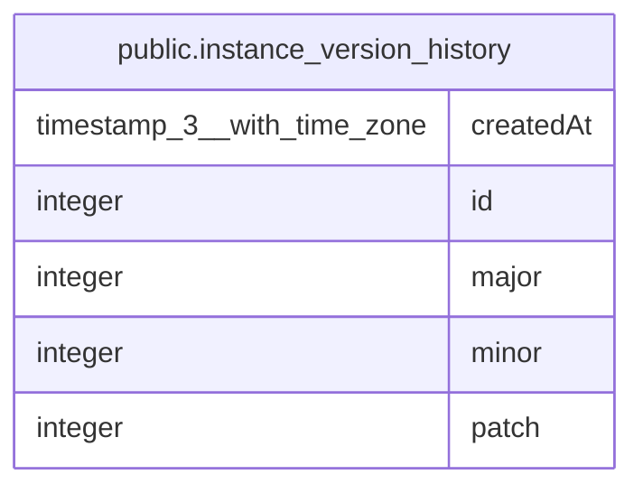

# public.instance_version_history

## Columns

| Name | Type | Default | Nullable | Children | Parents | Comment |
| ---- | ---- | ------- | -------- | -------- | ------- | ------- |
| createdAt | timestamp(3) with time zone | CURRENT_TIMESTAMP(3) | false |  |  |  |
| id | integer | nextval('instance_version_history_id_seq'::regclass) | false |  |  |  |
| major | integer |  | false |  |  |  |
| minor | integer |  | false |  |  |  |
| patch | integer |  | false |  |  |  |

## Constraints

| Name | Type | Definition |
| ---- | ---- | ---------- |
| PK_874f58cb616935bf49d9dbd67e9 | PRIMARY KEY | PRIMARY KEY (id) |
| instance_version_history_createdAt_not_null | n | NOT NULL "createdAt" |
| instance_version_history_id_not_null | n | NOT NULL id |
| instance_version_history_major_not_null | n | NOT NULL major |
| instance_version_history_minor_not_null | n | NOT NULL minor |
| instance_version_history_patch_not_null | n | NOT NULL patch |

## Indexes

| Name | Definition |
| ---- | ---------- |
| PK_874f58cb616935bf49d9dbd67e9 | CREATE UNIQUE INDEX "PK_874f58cb616935bf49d9dbd67e9" ON public.instance_version_history USING btree (id) |

## Relations

---

> Generated by [tbls](https://github.com/k1LoW/tbls)
