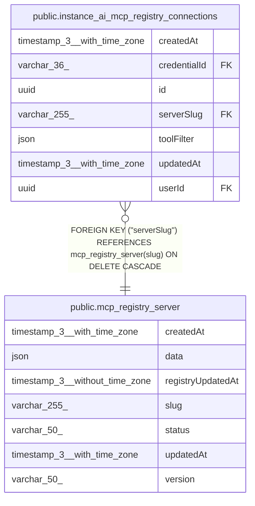

# public.mcp_registry_server

## Columns

| Name | Type | Default | Nullable | Children | Parents | Comment |
| ---- | ---- | ------- | -------- | -------- | ------- | ------- |
| createdAt | timestamp(3) with time zone | CURRENT_TIMESTAMP(3) | false |  |  |  |
| data | json | '{}'::json | false |  |  | JSON object containing server metadata (icons, remotes, tools, etc.) |
| registryUpdatedAt | timestamp(3) without time zone |  | false |  |  |  |
| slug | varchar(255) |  | false | [public.instance_ai_mcp_registry_connections](public.instance_ai_mcp_registry_connections.md) |  |  |
| status | varchar(50) |  | false |  |  | Server status in the MCP registry. Deprecated servers are not surfaced to users. |
| updatedAt | timestamp(3) with time zone | CURRENT_TIMESTAMP(3) | false |  |  |  |
| version | varchar(50) |  | false |  |  |  |

## Constraints

| Name | Type | Definition |
| ---- | ---- | ---------- |
| CHK_tmp_mcp_registry_server_status | CHECK | CHECK (((status)::text = ANY ((ARRAY['active'::character varying, 'deprecated'::character varying])::text[]))) |
| PK_12fd89a1fb8489513b0a91f5d31 | PRIMARY KEY | PRIMARY KEY (slug) |
| tmp_mcp_registry_server_createdAt_not_null | n | NOT NULL "createdAt" |
| tmp_mcp_registry_server_data_not_null | n | NOT NULL data |
| tmp_mcp_registry_server_registryUpdatedAt_not_null | n | NOT NULL "registryUpdatedAt" |
| tmp_mcp_registry_server_slug_not_null | n | NOT NULL slug |
| tmp_mcp_registry_server_status_not_null | n | NOT NULL status |
| tmp_mcp_registry_server_updatedAt_not_null | n | NOT NULL "updatedAt" |
| tmp_mcp_registry_server_version_not_null | n | NOT NULL version |

## Indexes

| Name | Definition |
| ---- | ---------- |
| PK_12fd89a1fb8489513b0a91f5d31 | CREATE UNIQUE INDEX "PK_12fd89a1fb8489513b0a91f5d31" ON public.mcp_registry_server USING btree (slug) |

## Relations

---

> Generated by [tbls](https://github.com/k1LoW/tbls)
