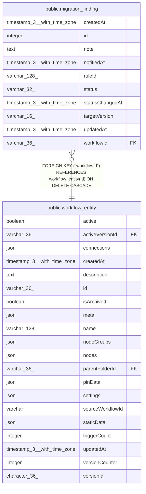

# public.migration_finding

## Columns

| Name | Type | Default | Nullable | Children | Parents | Comment |
| ---- | ---- | ------- | -------- | -------- | ------- | ------- |
| createdAt | timestamp(3) with time zone | CURRENT_TIMESTAMP(3) | false |  |  |  |
| id | integer |  | false |  |  |  |
| note | text |  | true |  |  | Free-text triage note set by a user. |
| notifiedAt | timestamp(3) with time zone |  | true |  |  | When the workflow owner was last notified. NULL when never notified. |
| ruleId | varchar(128) |  | false |  |  | Id of the breaking-change rule that produced the finding. |
| status | varchar(32) | 'open'::character varying | false |  |  | MigrationFindingStatus enum: "open", "notified", "fixed", "fixed_unpublished", "wont_fix". |
| statusChangedAt | timestamp(3) with time zone |  | false |  |  | When `status` last changed. Set on insert. |
| targetVersion | varchar(16) |  | false |  |  | BreakingChangeVersion enum: the n8n major version the finding applies to. |
| updatedAt | timestamp(3) with time zone | CURRENT_TIMESTAMP(3) | false |  |  |  |
| workflowId | varchar(36) |  | false |  | [public.workflow_entity](public.workflow_entity.md) |  |

## Constraints

| Name | Type | Definition |
| ---- | ---- | ---------- |
| CHK_migration_finding_status | CHECK | CHECK (((status)::text = ANY ((ARRAY['open'::character varying, 'notified'::character varying, 'fixed'::character varying, 'fixed_unpublished'::character varying, 'wont_fix'::character varying])::text[]))) |
| CHK_migration_finding_targetVersion | CHECK | CHECK ((("targetVersion")::text = ANY ((ARRAY['v2'::character varying, 'v3'::character varying])::text[]))) |
| FK_88d7006b4ae5e8fd891189886be | FOREIGN KEY | FOREIGN KEY ("workflowId") REFERENCES workflow_entity(id) ON DELETE CASCADE |
| PK_6673f5c38158b0d3c0e96f9f57d | PRIMARY KEY | PRIMARY KEY (id) |
| migration_finding_createdAt_not_null | n | NOT NULL "createdAt" |
| migration_finding_id_not_null | n | NOT NULL id |
| migration_finding_ruleId_not_null | n | NOT NULL "ruleId" |
| migration_finding_statusChangedAt_not_null | n | NOT NULL "statusChangedAt" |
| migration_finding_status_not_null | n | NOT NULL status |
| migration_finding_targetVersion_not_null | n | NOT NULL "targetVersion" |
| migration_finding_updatedAt_not_null | n | NOT NULL "updatedAt" |
| migration_finding_workflowId_not_null | n | NOT NULL "workflowId" |

## Indexes

| Name | Definition |
| ---- | ---------- |
| IDX_88d7006b4ae5e8fd891189886b | CREATE INDEX "IDX_88d7006b4ae5e8fd891189886b" ON public.migration_finding USING btree ("workflowId") |
| IDX_8d6481028c7d874ef4d2eabff9 | CREATE UNIQUE INDEX "IDX_8d6481028c7d874ef4d2eabff9" ON public.migration_finding USING btree ("targetVersion", "ruleId", "workflowId") |
| PK_6673f5c38158b0d3c0e96f9f57d | CREATE UNIQUE INDEX "PK_6673f5c38158b0d3c0e96f9f57d" ON public.migration_finding USING btree (id) |

## Relations

---

> Generated by [tbls](https://github.com/k1LoW/tbls)
