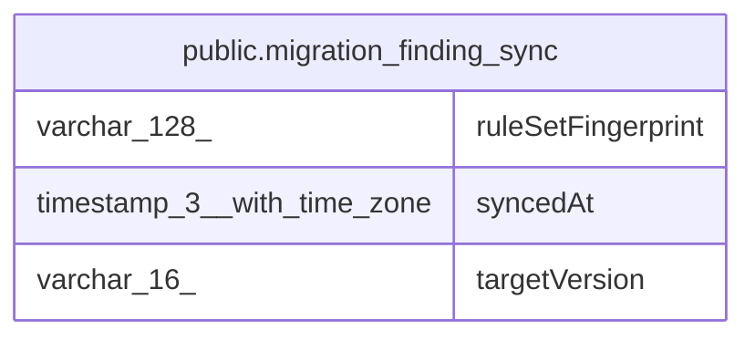

# public.migration_finding_sync

## Columns

| Name | Type | Default | Nullable | Children | Parents | Comment |
| ---- | ---- | ------- | -------- | -------- | ------- | ------- |
| ruleSetFingerprint | varchar(128) |  | false |  |  | Hash of the rule ids active during the last scan. A change triggers a full re-scan. |
| syncedAt | timestamp(3) with time zone |  | false |  |  | When the last scan for this target version wrote to migration_finding. |
| targetVersion | varchar(16) |  | false |  |  | BreakingChangeVersion enum: one sync record per target version. |

## Constraints

| Name | Type | Definition |
| ---- | ---- | ---------- |
| CHK_migration_finding_sync_targetVersion | CHECK | CHECK ((("targetVersion")::text = ANY ((ARRAY['v2'::character varying, 'v3'::character varying])::text[]))) |
| PK_2c7b962263dcafdf86a0ba7086d | PRIMARY KEY | PRIMARY KEY ("targetVersion") |
| migration_finding_sync_ruleSetFingerprint_not_null | n | NOT NULL "ruleSetFingerprint" |
| migration_finding_sync_syncedAt_not_null | n | NOT NULL "syncedAt" |
| migration_finding_sync_targetVersion_not_null | n | NOT NULL "targetVersion" |

## Indexes

| Name | Definition |
| ---- | ---------- |
| PK_2c7b962263dcafdf86a0ba7086d | CREATE UNIQUE INDEX "PK_2c7b962263dcafdf86a0ba7086d" ON public.migration_finding_sync USING btree ("targetVersion") |

## Relations

---

> Generated by [tbls](https://github.com/k1LoW/tbls)
