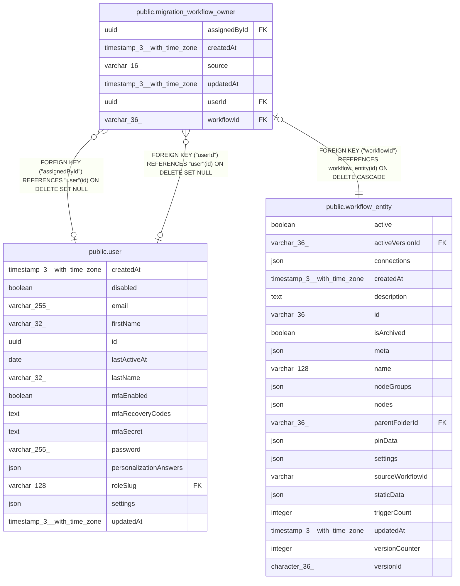

# public.migration_workflow_owner

## Columns

| Name | Type | Default | Nullable | Children | Parents | Comment |
| ---- | ---- | ------- | -------- | -------- | ------- | ------- |
| assignedById | uuid |  | true |  | [public.user](public.user.md) | Who assigned the owner. NULL for a suggestion, or after that user was deleted. |
| createdAt | timestamp(3) with time zone | CURRENT_TIMESTAMP(3) | false |  |  |  |
| source | varchar(16) |  | false |  |  | MigrationOwnerSource enum: "suggested" by the heuristic, or "assigned" by a person. |
| updatedAt | timestamp(3) with time zone | CURRENT_TIMESTAMP(3) | false |  |  |  |
| userId | uuid |  | true |  | [public.user](public.user.md) | The owner. NULL after the user was deleted. |
| workflowId | varchar(36) |  | false |  | [public.workflow_entity](public.workflow_entity.md) |  |

## Constraints

| Name | Type | Definition |
| ---- | ---- | ---------- |
| CHK_migration_workflow_owner_source | CHECK | CHECK (((source)::text = ANY ((ARRAY['suggested'::character varying, 'assigned'::character varying])::text[]))) |
| FK_59cde25bbb0edbb82286e4806d2 | FOREIGN KEY | FOREIGN KEY ("workflowId") REFERENCES workflow_entity(id) ON DELETE CASCADE |
| FK_ca859918be95d42fa6f698791c3 | FOREIGN KEY | FOREIGN KEY ("userId") REFERENCES "user"(id) ON DELETE SET NULL |
| FK_e6e5e4cab49ec23a544ffc9337a | FOREIGN KEY | FOREIGN KEY ("assignedById") REFERENCES "user"(id) ON DELETE SET NULL |
| PK_59cde25bbb0edbb82286e4806d2 | PRIMARY KEY | PRIMARY KEY ("workflowId") |
| migration_workflow_owner_createdAt_not_null | n | NOT NULL "createdAt" |
| migration_workflow_owner_source_not_null | n | NOT NULL source |
| migration_workflow_owner_updatedAt_not_null | n | NOT NULL "updatedAt" |
| migration_workflow_owner_workflowId_not_null | n | NOT NULL "workflowId" |

## Indexes

| Name | Definition |
| ---- | ---------- |
| IDX_ca859918be95d42fa6f698791c | CREATE INDEX "IDX_ca859918be95d42fa6f698791c" ON public.migration_workflow_owner USING btree ("userId") |
| PK_59cde25bbb0edbb82286e4806d2 | CREATE UNIQUE INDEX "PK_59cde25bbb0edbb82286e4806d2" ON public.migration_workflow_owner USING btree ("workflowId") |

## Relations

---

> Generated by [tbls](https://github.com/k1LoW/tbls)
