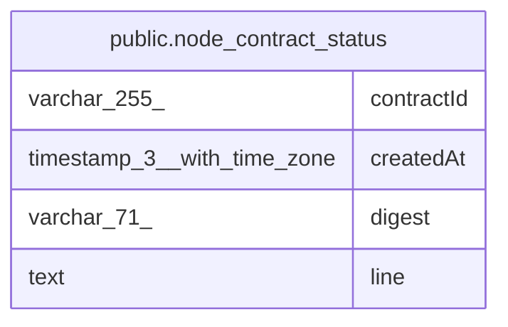

# public.node_contract_status

## Columns

| Name | Type | Default | Nullable | Children | Parents | Comment |
| ---- | ---- | ------- | -------- | -------- | ------- | ------- |
| contractId | varchar(255) |  | false |  |  | Contract or credential id, e.g. notion.databasePage.getAll |
| createdAt | timestamp(3) with time zone | CURRENT_TIMESTAMP(3) | false |  |  |  |
| digest | varchar(71) |  | false |  |  | sha256:\<hex\> of the line. It identifies the status line |
| line | text |  | false |  |  | The JSON status line: a yank, a revoke or a deprecation of versions |

## Constraints

| Name | Type | Definition |
| ---- | ---- | ---------- |
| PK_a024806064c1dedad9505cfabe9 | PRIMARY KEY | PRIMARY KEY (digest) |
| node_contract_status_contractId_not_null | n | NOT NULL "contractId" |
| node_contract_status_createdAt_not_null | n | NOT NULL "createdAt" |
| node_contract_status_digest_not_null | n | NOT NULL digest |
| node_contract_status_line_not_null | n | NOT NULL line |

## Indexes

| Name | Definition |
| ---- | ---------- |
| IDX_a2de1334540be1ba17cd10b3f6 | CREATE INDEX "IDX_a2de1334540be1ba17cd10b3f6" ON public.node_contract_status USING btree ("contractId") |
| PK_a024806064c1dedad9505cfabe9 | CREATE UNIQUE INDEX "PK_a024806064c1dedad9505cfabe9" ON public.node_contract_status USING btree (digest) |

## Relations

---

> Generated by [tbls](https://github.com/k1LoW/tbls)
