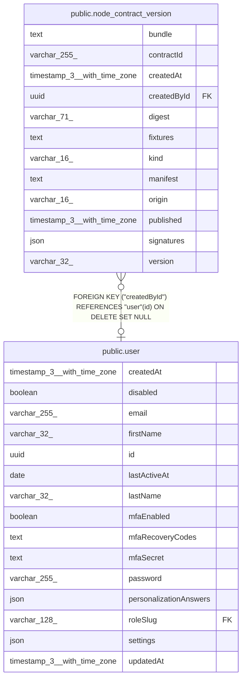

# public.node_contract_version

## Columns

| Name | Type | Default | Nullable | Children | Parents | Comment |
| ---- | ---- | ------- | -------- | -------- | ------- | ------- |
| bundle | text |  | true |  |  | The bundle code. A credential or native version has none |
| contractId | varchar(255) |  | false |  |  | Contract or credential id, e.g. notion.databasePage.getAll |
| createdAt | timestamp(3) with time zone | CURRENT_TIMESTAMP(3) | false |  |  |  |
| createdById | uuid |  | true |  | [public.user](public.user.md) | The user who published the version on this instance |
| digest | varchar(71) |  | false |  |  | sha256:\<hex\> of the manifest bytes. It identifies the version |
| fixtures | text |  | true |  |  | The fixtures that publish replayed, as JSON |
| kind | varchar(16) |  | false |  |  | What the manifest describes |
| manifest | text |  | false |  |  | The exact manifest bytes that the digest covers |
| origin | varchar(16) |  | false |  |  | Who vouches for the version, from the signing key at admission |
| published | timestamp(3) with time zone |  | true |  |  | When publish added the version |
| signatures | json |  | false |  |  | Publisher signatures of the manifest bytes: [{ key, sig }] |
| version | varchar(32) |  | false |  |  | Semver major.minor.patch |

## Constraints

| Name | Type | Definition |
| ---- | ---- | ---------- |
| CHK_node_contract_version_kind | CHECK | CHECK (((kind)::text = ANY ((ARRAY['action'::character varying, 'trigger'::character varying, 'provider'::character varying, 'credential'::character varying])::text[]))) |
| CHK_node_contract_version_origin | CHECK | CHECK (((origin)::text = ANY ((ARRAY['first-party'::character varying, 'community'::character varying, 'private'::character varying])::text[]))) |
| FK_842ea5efdd7093aa855e6327831 | FOREIGN KEY | FOREIGN KEY ("createdById") REFERENCES "user"(id) ON DELETE SET NULL |
| PK_7eb59e055394f3de1fb9fc99abd | PRIMARY KEY | PRIMARY KEY (digest) |
| node_contract_version_contractId_not_null | n | NOT NULL "contractId" |
| node_contract_version_createdAt_not_null | n | NOT NULL "createdAt" |
| node_contract_version_digest_not_null | n | NOT NULL digest |
| node_contract_version_kind_not_null | n | NOT NULL kind |
| node_contract_version_manifest_not_null | n | NOT NULL manifest |
| node_contract_version_origin_not_null | n | NOT NULL origin |
| node_contract_version_signatures_not_null | n | NOT NULL signatures |
| node_contract_version_version_not_null | n | NOT NULL version |

## Indexes

| Name | Definition |
| ---- | ---------- |
| IDX_437181719edbcad52b7dd305da | CREATE UNIQUE INDEX "IDX_437181719edbcad52b7dd305da" ON public.node_contract_version USING btree ("contractId", version) |
| PK_7eb59e055394f3de1fb9fc99abd | CREATE UNIQUE INDEX "PK_7eb59e055394f3de1fb9fc99abd" ON public.node_contract_version USING btree (digest) |

## Relations

---

> Generated by [tbls](https://github.com/k1LoW/tbls)
