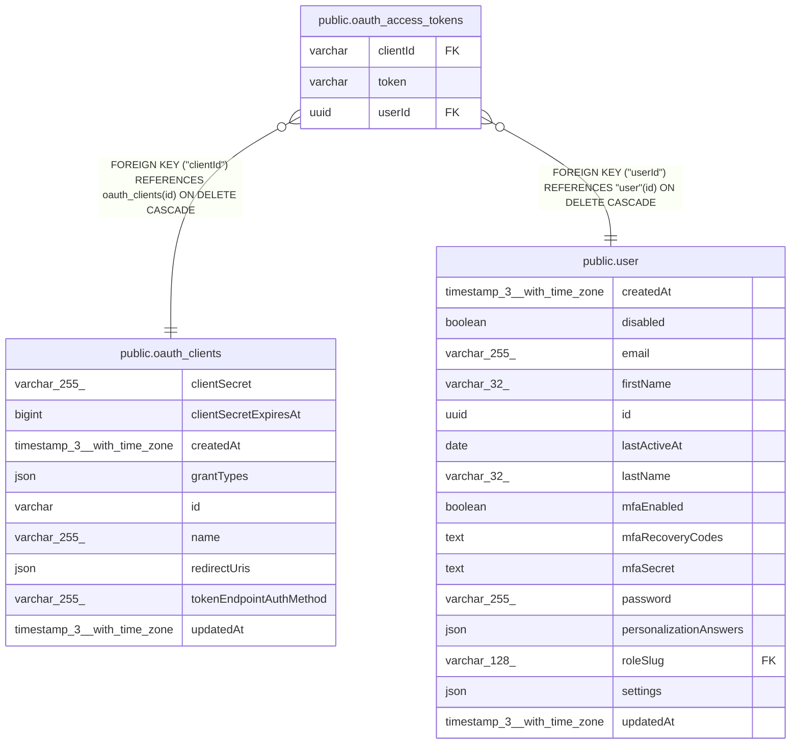

# public.oauth_access_tokens

## Columns

| Name | Type | Default | Nullable | Children | Parents | Comment |
| ---- | ---- | ------- | -------- | -------- | ------- | ------- |
| clientId | varchar |  | false |  | [public.oauth_clients](public.oauth_clients.md) |  |
| token | varchar |  | false |  |  |  |
| userId | uuid |  | false |  | [public.user](public.user.md) |  |

## Constraints

| Name | Type | Definition |
| ---- | ---- | ---------- |
| FK_7234a36d8e49a1fa85095328845 | FOREIGN KEY | FOREIGN KEY ("userId") REFERENCES "user"(id) ON DELETE CASCADE |
| FK_78b26968132b7e5e45b75876481 | FOREIGN KEY | FOREIGN KEY ("clientId") REFERENCES oauth_clients(id) ON DELETE CASCADE |
| PK_dcd71f96a5d5f4bf79e67d322bf | PRIMARY KEY | PRIMARY KEY (token) |
| oauth_access_tokens_clientId_not_null | n | NOT NULL "clientId" |
| oauth_access_tokens_token_not_null | n | NOT NULL token |
| oauth_access_tokens_userId_not_null | n | NOT NULL "userId" |

## Indexes

| Name | Definition |
| ---- | ---------- |
| PK_dcd71f96a5d5f4bf79e67d322bf | CREATE UNIQUE INDEX "PK_dcd71f96a5d5f4bf79e67d322bf" ON public.oauth_access_tokens USING btree (token) |

## Relations

---

> Generated by [tbls](https://github.com/k1LoW/tbls)
