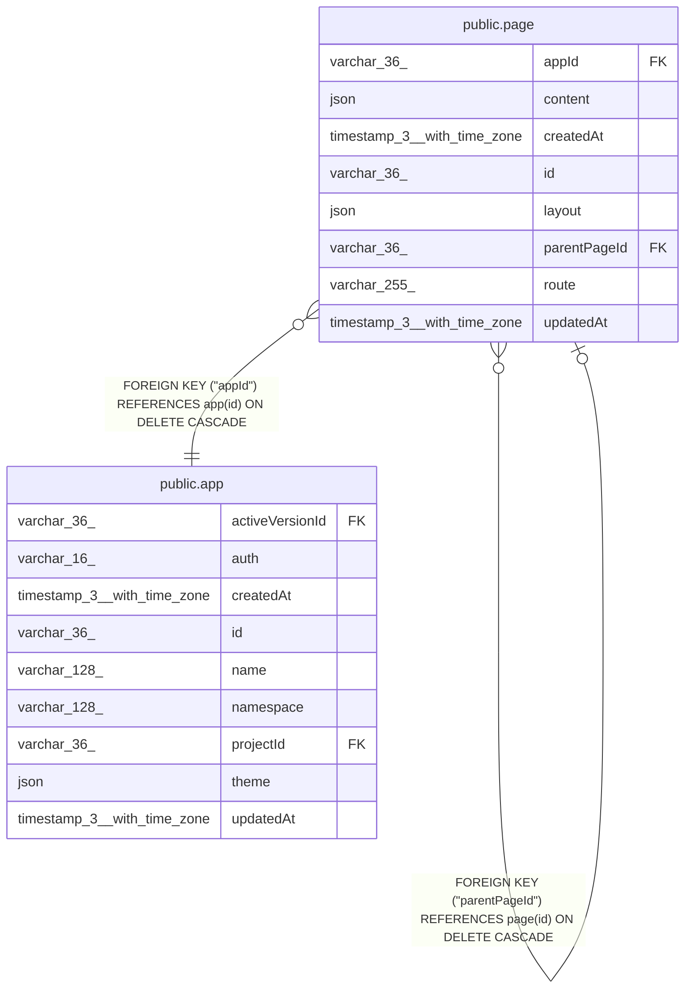

# public.page

## Columns

| Name | Type | Default | Nullable | Children | Parents | Comment |
| ---- | ---- | ------- | -------- | -------- | ------- | ------- |
| appId | varchar(36) |  | false |  | [public.app](public.app.md) |  |
| content | json |  | true |  |  | Block tree (Editor.js-shaped); empty until the renderer lands |
| createdAt | timestamp(3) with time zone | CURRENT_TIMESTAMP(3) | false |  |  |  |
| id | varchar(36) |  | false | [public.page](public.page.md) |  |  |
| layout | json |  | true |  |  | Blocks rendered around the page content, with one slot block; null inherits the nearest ancestor layout |
| parentPageId | varchar(36) |  | true |  | [public.page](public.page.md) | Self-reference; null for a top-level page |
| route | varchar(255) |  | false |  |  | Path segment under its parent, may contain :params |
| updatedAt | timestamp(3) with time zone | CURRENT_TIMESTAMP(3) | false |  |  |  |

## Constraints

| Name | Type | Definition |
| ---- | ---- | ---------- |
| FK_5e3cf5ed8328c4993a910bd239b | FOREIGN KEY | FOREIGN KEY ("appId") REFERENCES app(id) ON DELETE CASCADE |
| FK_b85a31f0bff1e857156d27ea152 | FOREIGN KEY | FOREIGN KEY ("parentPageId") REFERENCES page(id) ON DELETE CASCADE |
| PK_742f4117e065c5b6ad21b37ba1f | PRIMARY KEY | PRIMARY KEY (id) |
| page_appId_not_null | n | NOT NULL "appId" |
| page_createdAt_not_null | n | NOT NULL "createdAt" |
| page_id_not_null | n | NOT NULL id |
| page_route_not_null | n | NOT NULL route |
| page_updatedAt_not_null | n | NOT NULL "updatedAt" |

## Indexes

| Name | Definition |
| ---- | ---------- |
| IDX_page_appId | CREATE INDEX "IDX_page_appId" ON public.page USING btree ("appId") |
| IDX_page_parentPageId | CREATE INDEX "IDX_page_parentPageId" ON public.page USING btree ("parentPageId") |
| PK_742f4117e065c5b6ad21b37ba1f | CREATE UNIQUE INDEX "PK_742f4117e065c5b6ad21b37ba1f" ON public.page USING btree (id) |

## Relations

---

> Generated by [tbls](https://github.com/k1LoW/tbls)
