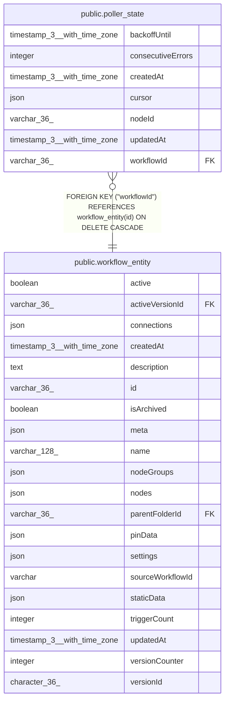

# public.poller_state

## Columns

| Name | Type | Default | Nullable | Children | Parents | Comment |
| ---- | ---- | ------- | -------- | -------- | ------- | ------- |
| backoffUntil | timestamp(3) with time zone |  | true |  |  | Time before which no poll is attempted; NULL when not backing off. |
| consecutiveErrors | integer | 0 | false |  |  | Polls that have failed since the last successful one. |
| createdAt | timestamp(3) with time zone | CURRENT_TIMESTAMP(3) | false |  |  |  |
| cursor | json | '{}'::json | false |  |  | How far the poll node has consumed its source, in whatever shape that node uses. |
| nodeId | varchar(36) |  | false |  |  |  |
| updatedAt | timestamp(3) with time zone | CURRENT_TIMESTAMP(3) | false |  |  |  |
| workflowId | varchar(36) |  | false |  | [public.workflow_entity](public.workflow_entity.md) |  |

## Constraints

| Name | Type | Definition |
| ---- | ---- | ---------- |
| FK_poller_state_workflowId | FOREIGN KEY | FOREIGN KEY ("workflowId") REFERENCES workflow_entity(id) ON DELETE CASCADE |
| PK_eda59336a5dd1e6a12f4d4b7287 | PRIMARY KEY | PRIMARY KEY ("workflowId", "nodeId") |
| poller_state_consecutiveErrors_not_null | n | NOT NULL "consecutiveErrors" |
| poller_state_createdAt_not_null | n | NOT NULL "createdAt" |
| poller_state_cursor_not_null | n | NOT NULL cursor |
| poller_state_nodeId_not_null | n | NOT NULL "nodeId" |
| poller_state_updatedAt_not_null | n | NOT NULL "updatedAt" |
| poller_state_workflowId_not_null | n | NOT NULL "workflowId" |

## Indexes

| Name | Definition |
| ---- | ---------- |
| PK_eda59336a5dd1e6a12f4d4b7287 | CREATE UNIQUE INDEX "PK_eda59336a5dd1e6a12f4d4b7287" ON public.poller_state USING btree ("workflowId", "nodeId") |

## Relations

---

> Generated by [tbls](https://github.com/k1LoW/tbls)
