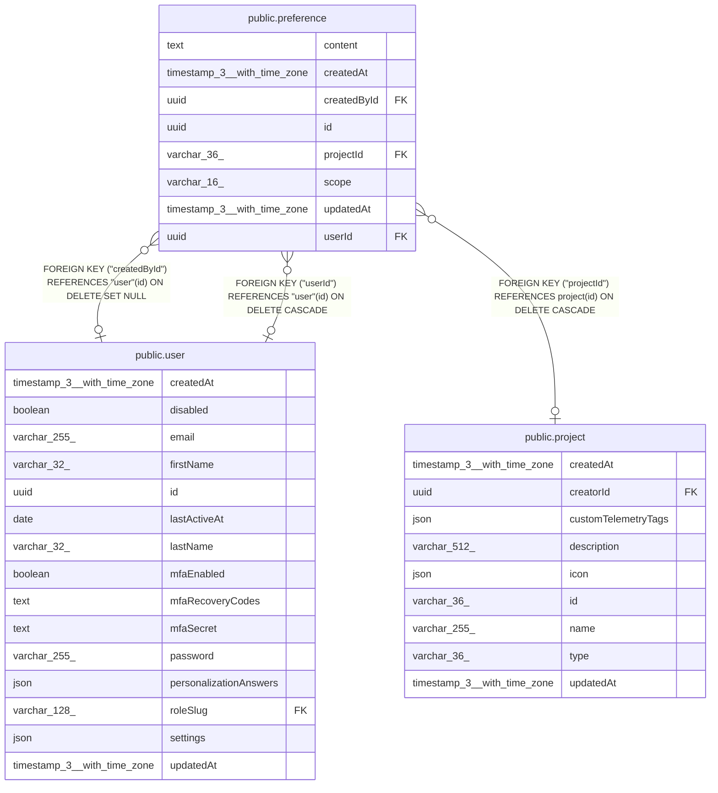

# public.preference

## Columns

| Name | Type | Default | Nullable | Children | Parents | Comment |
| ---- | ---- | ------- | -------- | -------- | ------- | ------- |
| content | text |  | false |  |  | Instruction text injected into AI prompts |
| createdAt | timestamp(3) with time zone | CURRENT_TIMESTAMP(3) | false |  |  |  |
| createdById | uuid |  | true |  | [public.user](public.user.md) | Author. NULL after the author is deleted |
| id | uuid |  | false |  |  |  |
| projectId | varchar(36) |  | true |  | [public.project](public.project.md) | Set only when scope is project |
| scope | varchar(16) |  | false |  |  | global: every user, every project. personal: one user, every project. project: every member of one project |
| updatedAt | timestamp(3) with time zone | CURRENT_TIMESTAMP(3) | false |  |  |  |
| userId | uuid |  | true |  | [public.user](public.user.md) | Set only when scope is personal |

## Constraints

| Name | Type | Definition |
| ---- | ---- | ---------- |
| CHK_preference_scope | CHECK | CHECK (((scope)::text = ANY ((ARRAY['global'::character varying, 'personal'::character varying, 'project'::character varying])::text[]))) |
| CHK_preference_scope_target | CHECK | CHECK (((((scope)::text = 'global'::text) AND ("userId" IS NULL) AND ("projectId" IS NULL)) OR (((scope)::text = 'personal'::text) AND ("userId" IS NOT NULL) AND ("projectId" IS NULL)) OR (((scope)::text = 'project'::text) AND ("userId" IS NULL) AND ("projectId" IS NOT NULL)))) |
| FK_0990a6dd2425968d479f4bb91e6 | FOREIGN KEY | FOREIGN KEY ("userId") REFERENCES "user"(id) ON DELETE CASCADE |
| FK_47d9aa5a32442eee284f45314ef | FOREIGN KEY | FOREIGN KEY ("createdById") REFERENCES "user"(id) ON DELETE SET NULL |
| FK_635b7d66838830328bc32423ef8 | FOREIGN KEY | FOREIGN KEY ("projectId") REFERENCES project(id) ON DELETE CASCADE |
| PK_5c4cbf49a1e97dcbc695bf462a6 | PRIMARY KEY | PRIMARY KEY (id) |
| preference_content_not_null | n | NOT NULL content |
| preference_createdAt_not_null | n | NOT NULL "createdAt" |
| preference_id_not_null | n | NOT NULL id |
| preference_scope_not_null | n | NOT NULL scope |
| preference_updatedAt_not_null | n | NOT NULL "updatedAt" |

## Indexes

| Name | Definition |
| ---- | ---------- |
| IDX_0990a6dd2425968d479f4bb91e | CREATE INDEX "IDX_0990a6dd2425968d479f4bb91e" ON public.preference USING btree ("userId") |
| IDX_47d9aa5a32442eee284f45314e | CREATE INDEX "IDX_47d9aa5a32442eee284f45314e" ON public.preference USING btree ("createdById") |
| IDX_635b7d66838830328bc32423ef | CREATE INDEX "IDX_635b7d66838830328bc32423ef" ON public.preference USING btree ("projectId") |
| PK_5c4cbf49a1e97dcbc695bf462a6 | CREATE UNIQUE INDEX "PK_5c4cbf49a1e97dcbc695bf462a6" ON public.preference USING btree (id) |

## Relations

---

> Generated by [tbls](https://github.com/k1LoW/tbls)
