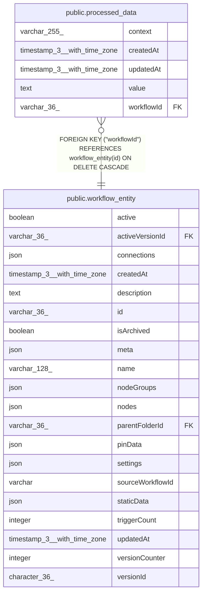

# public.processed_data

## Columns

| Name | Type | Default | Nullable | Children | Parents | Comment |
| ---- | ---- | ------- | -------- | -------- | ------- | ------- |
| context | varchar(255) |  | false |  |  |  |
| createdAt | timestamp(3) with time zone | CURRENT_TIMESTAMP(3) | false |  |  |  |
| updatedAt | timestamp(3) with time zone | CURRENT_TIMESTAMP(3) | false |  |  |  |
| value | text |  | false |  |  |  |
| workflowId | varchar(36) |  | false |  | [public.workflow_entity](public.workflow_entity.md) |  |

## Constraints

| Name | Type | Definition |
| ---- | ---- | ---------- |
| FK_06a69a7032c97a763c2c7599464 | FOREIGN KEY | FOREIGN KEY ("workflowId") REFERENCES workflow_entity(id) ON DELETE CASCADE |
| PK_ca04b9d8dc72de268fe07a65773 | PRIMARY KEY | PRIMARY KEY ("workflowId", context) |
| processed_data_context_not_null | n | NOT NULL context |
| processed_data_createdAt_not_null | n | NOT NULL "createdAt" |
| processed_data_updatedAt_not_null | n | NOT NULL "updatedAt" |
| processed_data_value_not_null | n | NOT NULL value |
| processed_data_workflowId_not_null | n | NOT NULL "workflowId" |

## Indexes

| Name | Definition |
| ---- | ---------- |
| PK_ca04b9d8dc72de268fe07a65773 | CREATE UNIQUE INDEX "PK_ca04b9d8dc72de268fe07a65773" ON public.processed_data USING btree ("workflowId", context) |

## Relations

---

> Generated by [tbls](https://github.com/k1LoW/tbls)
