# public.project

## Columns

| Name | Type | Default | Nullable | Children | Parents | Comment |
| ---- | ---- | ------- | -------- | -------- | ------- | ------- |
| createdAt | timestamp(3) with time zone | CURRENT_TIMESTAMP(3) | false |  |  |  |
| creatorId | uuid |  | true |  | [public.user](public.user.md) | ID of the user who created the project |
| customTelemetryTags | json | '[]'::json | false |  |  |  |
| description | varchar(512) |  | true |  |  |  |
| icon | json |  | true |  |  |  |
| id | varchar(36) |  | false | [public.agent_execution_threads](public.agent_execution_threads.md) [public.agents](public.agents.md) [public.data_table](public.data_table.md) [public.folder](public.folder.md) [public.insights_metadata](public.insights_metadata.md) [public.instance_ai_threads](public.instance_ai_threads.md) [public.project_relation](public.project_relation.md) [public.project_secrets_provider_access](public.project_secrets_provider_access.md) [public.role_mapping_rule_project](public.role_mapping_rule_project.md) [public.shared_credentials](public.shared_credentials.md) [public.shared_workflow](public.shared_workflow.md) [public.variables](public.variables.md) [public.workflow_review_request](public.workflow_review_request.md) |  |  |
| name | varchar(255) |  | false |  |  |  |
| type | varchar(36) |  | false |  |  |  |
| updatedAt | timestamp(3) with time zone | CURRENT_TIMESTAMP(3) | false |  |  |  |

## Constraints

| Name | Type | Definition |
| ---- | ---- | ---------- |
| PK_4d68b1358bb5b766d3e78f32f57 | PRIMARY KEY | PRIMARY KEY (id) |
| project_createdAt_not_null | n | NOT NULL "createdAt" |
| project_customTelemetryTags_not_null | n | NOT NULL "customTelemetryTags" |
| project_id_not_null | n | NOT NULL id |
| project_name_not_null | n | NOT NULL name |
| project_type_not_null | n | NOT NULL type |
| project_updatedAt_not_null | n | NOT NULL "updatedAt" |
| projects_creatorId_foreign | FOREIGN KEY | FOREIGN KEY ("creatorId") REFERENCES "user"(id) ON DELETE SET NULL |

## Indexes

| Name | Definition |
| ---- | ---------- |
| PK_4d68b1358bb5b766d3e78f32f57 | CREATE UNIQUE INDEX "PK_4d68b1358bb5b766d3e78f32f57" ON public.project USING btree (id) |

## Relations

```mermaid
erDiagram

"public.project" }o--o| "public.user" : "FOREIGN KEY (#quot;creatorId#quot;) REFERENCES #quot;user#quot;(id) ON DELETE SET NULL"
"public.agent_execution_threads" }o--|| "public.project" : "FOREIGN KEY (#quot;projectId#quot;) REFERENCES project(id) ON DELETE CASCADE"
"public.agents" }o--|| "public.project" : "FOREIGN KEY (#quot;projectId#quot;) REFERENCES project(id) ON DELETE CASCADE"
"public.data_table" }o--|| "public.project" : "FOREIGN KEY (#quot;projectId#quot;) REFERENCES project(id) ON DELETE CASCADE"
"public.folder" }o--|| "public.project" : "FOREIGN KEY (#quot;projectId#quot;) REFERENCES project(id) ON DELETE CASCADE"
"public.insights_metadata" }o--o| "public.project" : "FOREIGN KEY (#quot;projectId#quot;) REFERENCES project(id) ON DELETE SET NULL"
"public.instance_ai_threads" }o--|| "public.project" : "FOREIGN KEY (#quot;projectId#quot;) REFERENCES project(id) ON DELETE CASCADE"
"public.project_relation" }o--|| "public.project" : "FOREIGN KEY (#quot;projectId#quot;) REFERENCES project(id) ON DELETE CASCADE"
"public.project_secrets_provider_access" }o--|| "public.project" : "FOREIGN KEY (#quot;projectId#quot;) REFERENCES project(id) ON DELETE CASCADE"
"public.role_mapping_rule_project" }o--|| "public.project" : "FOREIGN KEY (#quot;projectId#quot;) REFERENCES project(id) ON DELETE CASCADE"
"public.shared_credentials" }o--|| "public.project" : "FOREIGN KEY (#quot;projectId#quot;) REFERENCES project(id) ON DELETE CASCADE"
"public.shared_workflow" }o--|| "public.project" : "FOREIGN KEY (#quot;projectId#quot;) REFERENCES project(id) ON DELETE CASCADE"
"public.variables" }o--o| "public.project" : "FOREIGN KEY (#quot;projectId#quot;) REFERENCES project(id) ON DELETE CASCADE"
"public.workflow_review_request" }o--|| "public.project" : "FOREIGN KEY (#quot;projectId#quot;) REFERENCES project(id) ON DELETE CASCADE"

"public.project" {
  timestamp_3__with_time_zone createdAt
  uuid creatorId FK
  json customTelemetryTags
  varchar_512_ description
  json icon
  varchar_36_ id
  varchar_255_ name
  varchar_36_ type
  timestamp_3__with_time_zone updatedAt
}
"public.user" {
  timestamp_3__with_time_zone createdAt
  boolean disabled
  varchar_255_ email
  varchar_32_ firstName
  uuid id
  date lastActiveAt
  varchar_32_ lastName
  boolean mfaEnabled
  text mfaRecoveryCodes
  text mfaSecret
  varchar_255_ password
  json personalizationAnswers
  varchar_128_ roleSlug FK
  json settings
  timestamp_3__with_time_zone updatedAt
}
"public.agent_execution_threads" {
  varchar_36_ agentId FK
  varchar_255_ agentName
  timestamp_3__with_time_zone createdAt
  varchar_8_ emoji
  varchar_128_ id
  varchar_36_ parentAgentId
  varchar_128_ parentThreadId
  varchar_255_ projectId FK
  integer sessionNumber
  varchar_32_ taskId
  varchar_36_ taskVersionId FK
  varchar_255_ title
  integer totalCompletionTokens
  double_precision totalCost
  integer totalDuration
  integer totalPromptTokens
  timestamp_3__with_time_zone updatedAt
}
"public.agents" {
  varchar_36_ activeVersionId FK
  timestamp_3__with_time_zone createdAt
  varchar_36_ id
  json integrations
  varchar_128_ name
  varchar_255_ projectId FK
  json schema
  json skills
  json tools
  timestamp_3__with_time_zone updatedAt
  varchar_36_ versionId
}
"public.data_table" {
  timestamp_3__with_time_zone createdAt
  varchar_36_ id
  varchar_128_ name
  varchar_36_ projectId FK
  timestamp_3__with_time_zone updatedAt
}
"public.folder" {
  timestamp_3__with_time_zone createdAt
  varchar_36_ id
  varchar_128_ name
  varchar_36_ parentFolderId FK
  varchar_36_ projectId FK
  timestamp_3__with_time_zone updatedAt
}
"public.insights_metadata" {
  integer metaId
  varchar_36_ projectId FK
  varchar_255_ projectName
  varchar_36_ workflowId FK
  varchar_128_ workflowName
}
"public.instance_ai_threads" {
  timestamp_3__with_time_zone createdAt
  uuid id
  json metadata
  varchar_36_ projectId FK
  varchar_255_ resourceId
  text title
  timestamp_3__with_time_zone updatedAt
}
"public.project_relation" {
  timestamp_3__with_time_zone createdAt
  varchar_36_ projectId FK
  varchar role FK
  timestamp_3__with_time_zone updatedAt
  uuid userId FK
}
"public.project_secrets_provider_access" {
  timestamp_3__with_time_zone createdAt
  varchar_36_ projectId FK
  varchar_128_ role
  integer secretsProviderConnectionId FK
  timestamp_3__with_time_zone updatedAt
}
"public.role_mapping_rule_project" {
  varchar_36_ projectId FK
  varchar_16_ roleMappingRuleId FK
}
"public.shared_credentials" {
  timestamp_3__with_time_zone createdAt
  varchar_36_ credentialsId FK
  varchar_36_ projectId FK
  text role
  timestamp_3__with_time_zone updatedAt
}
"public.shared_workflow" {
  timestamp_3__with_time_zone createdAt
  varchar_36_ projectId FK
  text role
  timestamp_3__with_time_zone updatedAt
  varchar_36_ workflowId FK
}
"public.variables" {
  varchar_36_ id
  varchar_50_ key
  varchar_36_ projectId FK
  varchar_50_ type
  text value
}
"public.workflow_review_request" {
  timestamp_3__with_time_zone approvedAt
  uuid closedById FK
  timestamp_3__with_time_zone createdAt
  uuid createdById FK
  varchar_50_ decision
  text description
  varchar_36_ id
  varchar_36_ projectId FK
  varchar_16_ state
  varchar_255_ title
  timestamp_3__with_time_zone updatedAt
  uuid updatedById FK
}
```

---

> Generated by [tbls](https://github.com/k1LoW/tbls)
