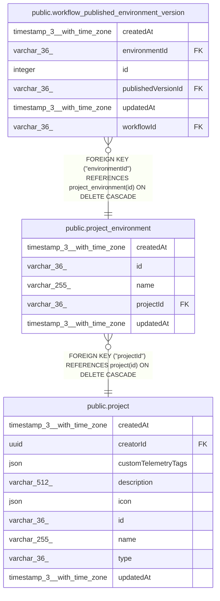

# public.project_environment

## Columns

| Name | Type | Default | Nullable | Children | Parents | Comment |
| ---- | ---- | ------- | -------- | -------- | ------- | ------- |
| createdAt | timestamp(3) with time zone | CURRENT_TIMESTAMP(3) | false |  |  |  |
| id | varchar(36) |  | false | [public.workflow_published_environment_version](public.workflow_published_environment_version.md) |  |  |
| name | varchar(255) |  | false |  |  |  |
| projectId | varchar(36) |  | false |  | [public.project](public.project.md) |  |
| updatedAt | timestamp(3) with time zone | CURRENT_TIMESTAMP(3) | false |  |  |  |

## Constraints

| Name | Type | Definition |
| ---- | ---- | ---------- |
| FK_ebc0d8d9118a7daa5df44a0c6f0 | FOREIGN KEY | FOREIGN KEY ("projectId") REFERENCES project(id) ON DELETE CASCADE |
| PK_7eac2e1c1ce819382ff78fa3e76 | PRIMARY KEY | PRIMARY KEY (id) |
| project_environment_createdAt_not_null | n | NOT NULL "createdAt" |
| project_environment_id_not_null | n | NOT NULL id |
| project_environment_name_not_null | n | NOT NULL name |
| project_environment_projectId_not_null | n | NOT NULL "projectId" |
| project_environment_updatedAt_not_null | n | NOT NULL "updatedAt" |

## Indexes

| Name | Definition |
| ---- | ---------- |
| IDX_ebc0d8d9118a7daa5df44a0c6f | CREATE INDEX "IDX_ebc0d8d9118a7daa5df44a0c6f" ON public.project_environment USING btree ("projectId") |
| PK_7eac2e1c1ce819382ff78fa3e76 | CREATE UNIQUE INDEX "PK_7eac2e1c1ce819382ff78fa3e76" ON public.project_environment USING btree (id) |

## Relations

---

> Generated by [tbls](https://github.com/k1LoW/tbls)
