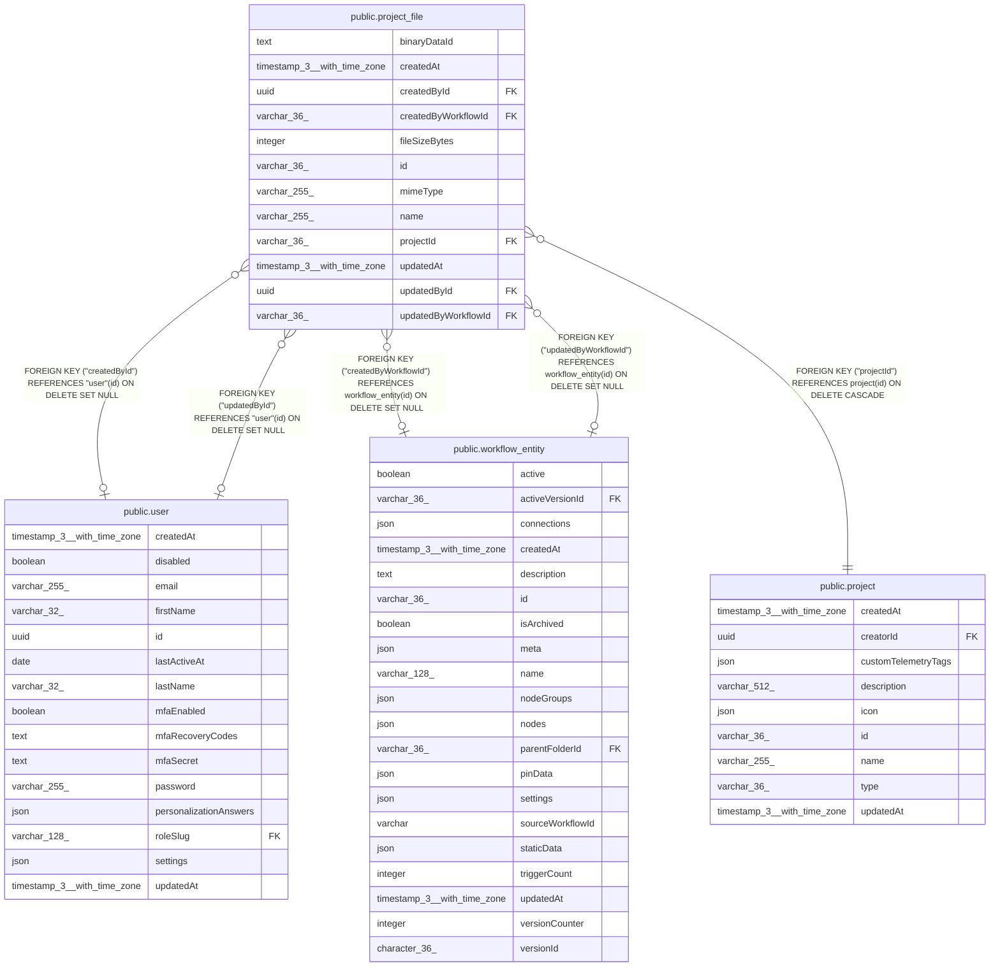

# public.project_file

## Columns

| Name | Type | Default | Nullable | Children | Parents | Comment |
| ---- | ---- | ------- | -------- | -------- | ------- | ------- |
| binaryDataId | text |  | false |  |  | Opaque BinaryDataService reference (mode-prefixed, e.g. "filesystem-v2:\<uuid\>"). Never leaves the server: /rest/binary-data has no ownership check. Not an FK to binary_data, which only has rows in DB storage mode |
| createdAt | timestamp(3) with time zone | CURRENT_TIMESTAMP(3) | false |  |  |  |
| createdById | uuid |  | true |  | [public.user](public.user.md) | User who uploaded the file, when a user did |
| createdByWorkflowId | varchar(36) |  | true |  | [public.workflow_entity](public.workflow_entity.md) | Workflow that created the file; written once the Project File node exists |
| fileSizeBytes | integer |  | false |  |  | File size in bytes; capped below 2 GiB by config validation |
| id | varchar(36) |  | false |  |  | Application-generated n8n nano ID |
| mimeType | varchar(255) |  | false |  |  |  |
| name | varchar(255) |  | false |  |  | Sanitized display name, unique within the project |
| projectId | varchar(36) |  | false |  | [public.project](public.project.md) | Project owning the file; authorization scope for all operations |
| updatedAt | timestamp(3) with time zone | CURRENT_TIMESTAMP(3) | false |  |  |  |
| updatedById | uuid |  | true |  | [public.user](public.user.md) | User who last modified the file, when a user did |
| updatedByWorkflowId | varchar(36) |  | true |  | [public.workflow_entity](public.workflow_entity.md) | Workflow that last modified the file; written once the Project File node exists |

## Constraints

| Name | Type | Definition |
| ---- | ---- | ---------- |
| FK_779d5988a1414ea1e93f02d4f73 | FOREIGN KEY | FOREIGN KEY ("updatedByWorkflowId") REFERENCES workflow_entity(id) ON DELETE SET NULL |
| FK_868385872f674f0427eed327f21 | FOREIGN KEY | FOREIGN KEY ("createdByWorkflowId") REFERENCES workflow_entity(id) ON DELETE SET NULL |
| FK_9cc23745241e6f1abeae2b4a0c9 | FOREIGN KEY | FOREIGN KEY ("updatedById") REFERENCES "user"(id) ON DELETE SET NULL |
| FK_f5f2d84aa927044d04172ba5b5f | FOREIGN KEY | FOREIGN KEY ("createdById") REFERENCES "user"(id) ON DELETE SET NULL |
| FK_f8b1098952dc5f55a00ee0c1f39 | FOREIGN KEY | FOREIGN KEY ("projectId") REFERENCES project(id) ON DELETE CASCADE |
| PK_9e8bbc6ccf0af1d25fbfcddcc80 | PRIMARY KEY | PRIMARY KEY (id) |
| project_file_binaryDataId_not_null | n | NOT NULL "binaryDataId" |
| project_file_createdAt_not_null | n | NOT NULL "createdAt" |
| project_file_fileSizeBytes_not_null | n | NOT NULL "fileSizeBytes" |
| project_file_id_not_null | n | NOT NULL id |
| project_file_mimeType_not_null | n | NOT NULL "mimeType" |
| project_file_name_not_null | n | NOT NULL name |
| project_file_projectId_not_null | n | NOT NULL "projectId" |
| project_file_updatedAt_not_null | n | NOT NULL "updatedAt" |

## Indexes

| Name | Definition |
| ---- | ---------- |
| IDX_ff61cffdaf9f46646deba0274e | CREATE UNIQUE INDEX "IDX_ff61cffdaf9f46646deba0274e" ON public.project_file USING btree ("projectId", name) |
| PK_9e8bbc6ccf0af1d25fbfcddcc80 | CREATE UNIQUE INDEX "PK_9e8bbc6ccf0af1d25fbfcddcc80" ON public.project_file USING btree (id) |

## Relations

---

> Generated by [tbls](https://github.com/k1LoW/tbls)
