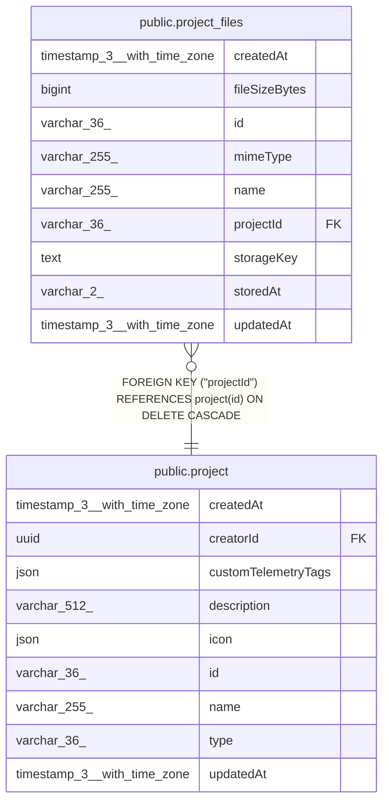

# public.project_files

## Columns

| Name | Type | Default | Nullable | Children | Parents | Comment |
| ---- | ---- | ------- | -------- | -------- | ------- | ------- |
| createdAt | timestamp(3) with time zone | CURRENT_TIMESTAMP(3) | false |  |  |  |
| fileSizeBytes | bigint |  | false |  |  | Content size in bytes; SUM()'d for the instance-wide storage quota |
| id | varchar(36) |  | false |  |  | Application-generated n8n nano ID |
| mimeType | varchar(255) |  | false |  |  |  |
| name | varchar(255) |  | false |  |  | Human handle, unique per project; slashes are plain characters, not folders |
| projectId | varchar(36) |  | false |  | [public.project](public.project.md) |  |
| storageKey | text |  | false |  |  | Key addressing the bytes within storedAt: a binary_data.fileId for db, a byte-store key otherwise. Not a foreign key. Replace swaps this to a freshly written key |
| storedAt | varchar(2) | 'fs'::character varying | false |  |  | Where the file bytes live: 'db' (binary_data table), or a blob-storage backend ('fs', 's3', 'az') |
| updatedAt | timestamp(3) with time zone | CURRENT_TIMESTAMP(3) | false |  |  |  |

## Constraints

| Name | Type | Definition |
| ---- | ---- | ---------- |
| CHK_project_files_storedAt | CHECK | CHECK ((("storedAt")::text = ANY ((ARRAY['fs'::character varying, 's3'::character varying, 'az'::character varying, 'db'::character varying])::text[]))) |
| FK_c5cabbbe2a2cf99b20f94eb94f3 | FOREIGN KEY | FOREIGN KEY ("projectId") REFERENCES project(id) ON DELETE CASCADE |
| PK_ba9b1f07ba163e0e21f72f4e02b | PRIMARY KEY | PRIMARY KEY (id) |
| project_files_createdAt_not_null | n | NOT NULL "createdAt" |
| project_files_fileSizeBytes_not_null | n | NOT NULL "fileSizeBytes" |
| project_files_id_not_null | n | NOT NULL id |
| project_files_mimeType_not_null | n | NOT NULL "mimeType" |
| project_files_name_not_null | n | NOT NULL name |
| project_files_projectId_not_null | n | NOT NULL "projectId" |
| project_files_storageKey_not_null | n | NOT NULL "storageKey" |
| project_files_storedAt_not_null | n | NOT NULL "storedAt" |
| project_files_updatedAt_not_null | n | NOT NULL "updatedAt" |

## Indexes

| Name | Definition |
| ---- | ---------- |
| IDX_801c046e14d84242d135b1dc70 | CREATE UNIQUE INDEX "IDX_801c046e14d84242d135b1dc70" ON public.project_files USING btree ("projectId", name) |
| IDX_96507fcd12a91b38193b7d9d89 | CREATE INDEX "IDX_96507fcd12a91b38193b7d9d89" ON public.project_files USING btree ("projectId", "updatedAt") |
| PK_ba9b1f07ba163e0e21f72f4e02b | CREATE UNIQUE INDEX "PK_ba9b1f07ba163e0e21f72f4e02b" ON public.project_files USING btree (id) |

## Relations

---

> Generated by [tbls](https://github.com/k1LoW/tbls)
