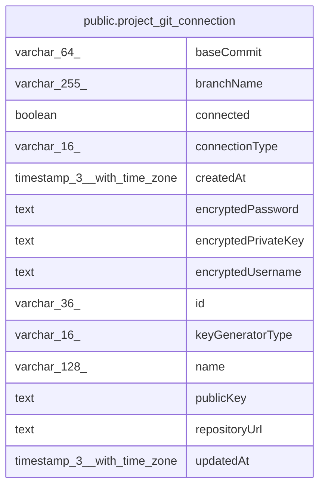

# public.project_git_connection

## Columns

| Name | Type | Default | Nullable | Children | Parents | Comment |
| ---- | ---- | ------- | -------- | -------- | ------- | ------- |
| baseCommit | varchar(64) |  | true |  |  |  |
| branchName | varchar(255) |  | true |  |  |  |
| connected | boolean | false | false |  |  |  |
| connectionType | varchar(16) |  | false |  |  | GitConnectionType enum: "ssh", "https" |
| createdAt | timestamp(3) with time zone | CURRENT_TIMESTAMP(3) | false |  |  |  |
| encryptedPassword | text |  | true |  |  |  |
| encryptedPrivateKey | text |  | true |  |  |  |
| encryptedUsername | text |  | true |  |  |  |
| id | varchar(36) |  | false |  |  |  |
| keyGeneratorType | varchar(16) |  | true |  |  | GitKeyGeneratorType enum: "ed25519", "rsa" |
| name | varchar(128) |  | false |  |  |  |
| publicKey | text |  | true |  |  |  |
| repositoryUrl | text |  | false |  |  |  |
| updatedAt | timestamp(3) with time zone | CURRENT_TIMESTAMP(3) | false |  |  |  |

## Constraints

| Name | Type | Definition |
| ---- | ---- | ---------- |
| CHK_project_git_connection_connectionType | CHECK | CHECK ((("connectionType")::text = ANY ((ARRAY['ssh'::character varying, 'https'::character varying])::text[]))) |
| CHK_project_git_connection_keyGeneratorType | CHECK | CHECK ((("keyGeneratorType")::text = ANY ((ARRAY['ed25519'::character varying, 'rsa'::character varying])::text[]))) |
| PK_a8b527f3722228a5ea367b9fc5a | PRIMARY KEY | PRIMARY KEY (id) |
| project_git_connection_connected_not_null | n | NOT NULL connected |
| project_git_connection_connectionType_not_null | n | NOT NULL "connectionType" |
| project_git_connection_createdAt_not_null | n | NOT NULL "createdAt" |
| project_git_connection_id_not_null | n | NOT NULL id |
| project_git_connection_name_not_null | n | NOT NULL name |
| project_git_connection_repositoryUrl_not_null | n | NOT NULL "repositoryUrl" |
| project_git_connection_updatedAt_not_null | n | NOT NULL "updatedAt" |

## Indexes

| Name | Definition |
| ---- | ---------- |
| PK_a8b527f3722228a5ea367b9fc5a | CREATE UNIQUE INDEX "PK_a8b527f3722228a5ea367b9fc5a" ON public.project_git_connection USING btree (id) |

## Relations

---

> Generated by [tbls](https://github.com/k1LoW/tbls)
