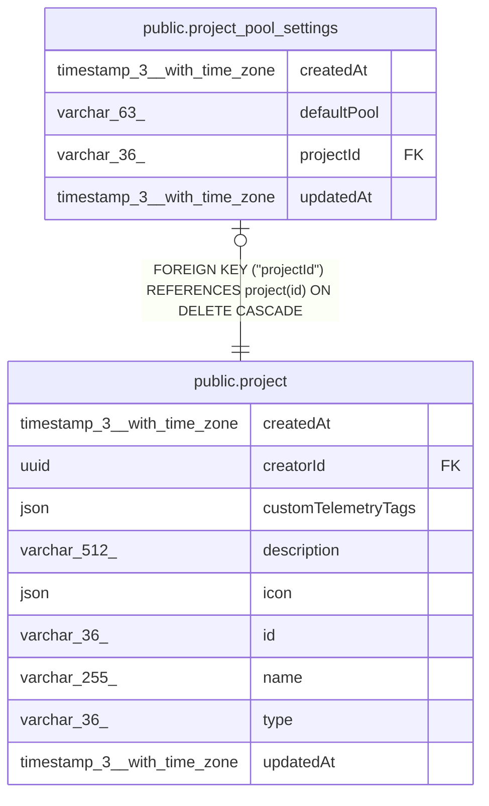

# public.project_pool_settings

## Columns

| Name | Type | Default | Nullable | Children | Parents | Comment |
| ---- | ---- | ------- | -------- | -------- | ------- | ------- |
| createdAt | timestamp(3) with time zone | CURRENT_TIMESTAMP(3) | false |  |  |  |
| defaultPool | varchar(63) |  | true |  |  |  |
| projectId | varchar(36) |  | false |  | [public.project](public.project.md) |  |
| updatedAt | timestamp(3) with time zone | CURRENT_TIMESTAMP(3) | false |  |  |  |

## Constraints

| Name | Type | Definition |
| ---- | ---- | ---------- |
| FK_6f5617b5fb0db43f92e39f5b626 | FOREIGN KEY | FOREIGN KEY ("projectId") REFERENCES project(id) ON DELETE CASCADE |
| PK_6f5617b5fb0db43f92e39f5b626 | PRIMARY KEY | PRIMARY KEY ("projectId") |
| project_pool_settings_createdAt_not_null | n | NOT NULL "createdAt" |
| project_pool_settings_projectId_not_null | n | NOT NULL "projectId" |
| project_pool_settings_updatedAt_not_null | n | NOT NULL "updatedAt" |

## Indexes

| Name | Definition |
| ---- | ---------- |
| PK_6f5617b5fb0db43f92e39f5b626 | CREATE UNIQUE INDEX "PK_6f5617b5fb0db43f92e39f5b626" ON public.project_pool_settings USING btree ("projectId") |

## Relations

---

> Generated by [tbls](https://github.com/k1LoW/tbls)
