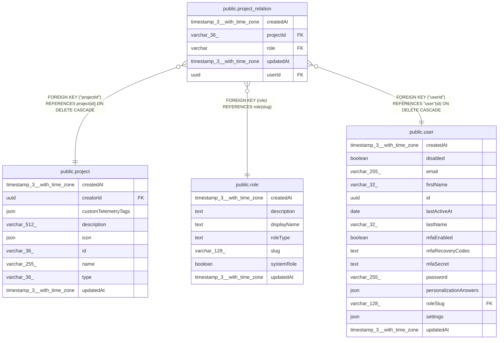

# public.project_relation

## Columns

| Name | Type | Default | Nullable | Children | Parents | Comment |
| ---- | ---- | ------- | -------- | -------- | ------- | ------- |
| createdAt | timestamp(3) with time zone | CURRENT_TIMESTAMP(3) | false |  |  |  |
| projectId | varchar(36) |  | false |  | [public.project](public.project.md) |  |
| role | varchar |  | false |  | [public.role](public.role.md) |  |
| updatedAt | timestamp(3) with time zone | CURRENT_TIMESTAMP(3) | false |  |  |  |
| userId | uuid |  | false |  | [public.user](public.user.md) |  |

## Constraints

| Name | Type | Definition |
| ---- | ---- | ---------- |
| FK_5f0643f6717905a05164090dde7 | FOREIGN KEY | FOREIGN KEY ("userId") REFERENCES "user"(id) ON DELETE CASCADE |
| FK_61448d56d61802b5dfde5cdb002 | FOREIGN KEY | FOREIGN KEY ("projectId") REFERENCES project(id) ON DELETE CASCADE |
| FK_c6b99592dc96b0d836d7a21db91 | FOREIGN KEY | FOREIGN KEY (role) REFERENCES role(slug) |
| PK_1caaa312a5d7184a003be0f0cb6 | PRIMARY KEY | PRIMARY KEY ("projectId", "userId") |
| project_relation_createdAt_not_null | n | NOT NULL "createdAt" |
| project_relation_projectId_not_null | n | NOT NULL "projectId" |
| project_relation_role_not_null | n | NOT NULL role |
| project_relation_updatedAt_not_null | n | NOT NULL "updatedAt" |
| project_relation_userId_not_null | n | NOT NULL "userId" |

## Indexes

| Name | Definition |
| ---- | ---------- |
| IDX_5f0643f6717905a05164090dde | CREATE INDEX "IDX_5f0643f6717905a05164090dde" ON public.project_relation USING btree ("userId") |
| IDX_61448d56d61802b5dfde5cdb00 | CREATE INDEX "IDX_61448d56d61802b5dfde5cdb00" ON public.project_relation USING btree ("projectId") |
| PK_1caaa312a5d7184a003be0f0cb6 | CREATE UNIQUE INDEX "PK_1caaa312a5d7184a003be0f0cb6" ON public.project_relation USING btree ("projectId", "userId") |
| project_relation_role_idx | CREATE INDEX project_relation_role_idx ON public.project_relation USING btree (role) |
| project_relation_role_project_idx | CREATE INDEX project_relation_role_project_idx ON public.project_relation USING btree ("projectId", role) |

## Relations

---

> Generated by [tbls](https://github.com/k1LoW/tbls)
