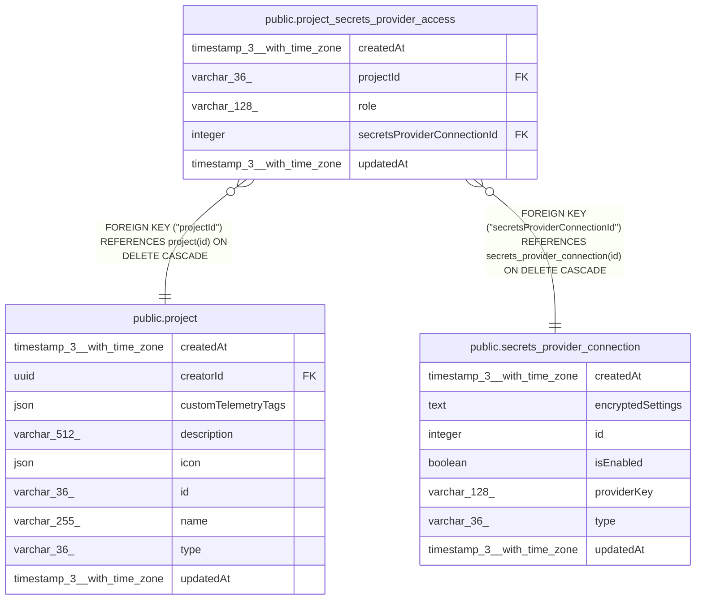

# public.project_secrets_provider_access

## Columns

| Name | Type | Default | Nullable | Children | Parents | Comment |
| ---- | ---- | ------- | -------- | -------- | ------- | ------- |
| createdAt | timestamp(3) with time zone | CURRENT_TIMESTAMP(3) | false |  |  |  |
| projectId | varchar(36) |  | false |  | [public.project](public.project.md) |  |
| role | varchar(128) | 'secretsProviderConnection:user'::character varying | false |  |  |  |
| secretsProviderConnectionId | integer |  | false |  | [public.secrets_provider_connection](public.secrets_provider_connection.md) |  |
| updatedAt | timestamp(3) with time zone | CURRENT_TIMESTAMP(3) | false |  |  |  |

## Constraints

| Name | Type | Definition |
| ---- | ---- | ---------- |
| CHK_project_secrets_provider_access_role | CHECK | CHECK (((role)::text = ANY ((ARRAY['secretsProviderConnection:owner'::character varying, 'secretsProviderConnection:user'::character varying])::text[]))) |
| FK_18e5c27d2524b1638b292904e48 | FOREIGN KEY | FOREIGN KEY ("secretsProviderConnectionId") REFERENCES secrets_provider_connection(id) ON DELETE CASCADE |
| FK_bd264b81209355b543878deedb1 | FOREIGN KEY | FOREIGN KEY ("projectId") REFERENCES project(id) ON DELETE CASCADE |
| PK_0402b7fcec5415246656f102f83 | PRIMARY KEY | PRIMARY KEY ("secretsProviderConnectionId", "projectId") |
| project_secrets_provider_ac_secretsProviderConnectionI_not_null | n | NOT NULL "secretsProviderConnectionId" |
| project_secrets_provider_access_createdAt_not_null | n | NOT NULL "createdAt" |
| project_secrets_provider_access_projectId_not_null | n | NOT NULL "projectId" |
| project_secrets_provider_access_role_not_null | n | NOT NULL role |
| project_secrets_provider_access_updatedAt_not_null | n | NOT NULL "updatedAt" |

## Indexes

| Name | Definition |
| ---- | ---------- |
| PK_0402b7fcec5415246656f102f83 | CREATE UNIQUE INDEX "PK_0402b7fcec5415246656f102f83" ON public.project_secrets_provider_access USING btree ("secretsProviderConnectionId", "projectId") |

## Relations

---

> Generated by [tbls](https://github.com/k1LoW/tbls)
