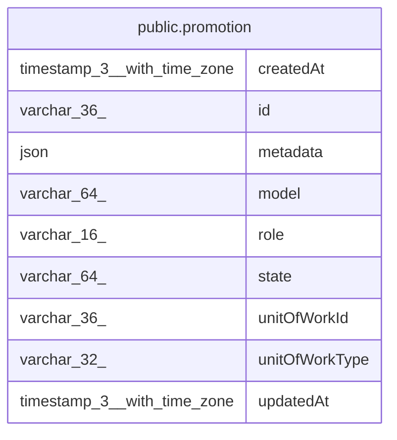

# public.promotion

## Columns

| Name | Type | Default | Nullable | Children | Parents | Comment |
| ---- | ---- | ------- | -------- | -------- | ------- | ------- |
| createdAt | timestamp(3) with time zone | CURRENT_TIMESTAMP(3) | false |  |  |  |
| id | varchar(36) |  | false |  |  |  |
| metadata | json |  | false |  |  | Model-specific data (peer instance ref, artifact refs, git branch, approvals) |
| model | varchar(64) |  | false |  |  | Promotion model that owns this lifecycle (e.g. direct-push); models register at runtime, so no enum check |
| role | varchar(16) |  | false |  |  | Role this instance plays in the promotion |
| state | varchar(64) |  | false |  |  | Lifecycle state; the vocabulary is owned by the promotion model |
| unitOfWorkId | varchar(36) |  | false |  |  | Id of the promoted unit on this instance; no FK because the target table depends on unitOfWorkType |
| unitOfWorkType | varchar(32) |  | false |  |  | Kind of unit being promoted (e.g. project) |
| updatedAt | timestamp(3) with time zone | CURRENT_TIMESTAMP(3) | false |  |  |  |

## Constraints

| Name | Type | Definition |
| ---- | ---- | ---------- |
| CHK_promotion_role | CHECK | CHECK (((role)::text = ANY ((ARRAY['source'::character varying, 'destination'::character varying])::text[]))) |
| PK_fab3630e0789a2002f1cadb7d38 | PRIMARY KEY | PRIMARY KEY (id) |
| promotion_createdAt_not_null | n | NOT NULL "createdAt" |
| promotion_id_not_null | n | NOT NULL id |
| promotion_metadata_not_null | n | NOT NULL metadata |
| promotion_model_not_null | n | NOT NULL model |
| promotion_role_not_null | n | NOT NULL role |
| promotion_state_not_null | n | NOT NULL state |
| promotion_unitOfWorkId_not_null | n | NOT NULL "unitOfWorkId" |
| promotion_unitOfWorkType_not_null | n | NOT NULL "unitOfWorkType" |
| promotion_updatedAt_not_null | n | NOT NULL "updatedAt" |

## Indexes

| Name | Definition |
| ---- | ---------- |
| PK_fab3630e0789a2002f1cadb7d38 | CREATE UNIQUE INDEX "PK_fab3630e0789a2002f1cadb7d38" ON public.promotion USING btree (id) |

## Relations

---

> Generated by [tbls](https://github.com/k1LoW/tbls)
