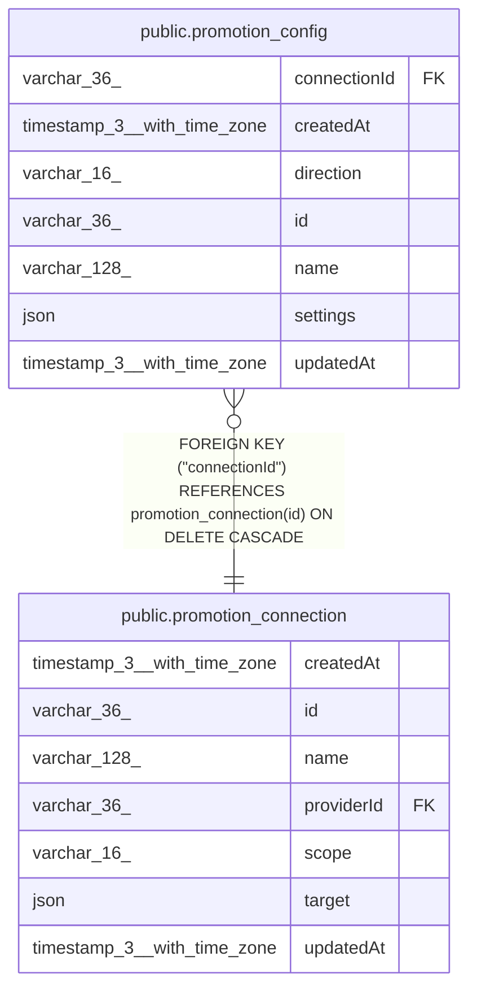

# public.promotion_config

## Columns

| Name | Type | Default | Nullable | Children | Parents | Comment |
| ---- | ---- | ------- | -------- | -------- | ------- | ------- |
| connectionId | varchar(36) |  | false |  | [public.promotion_connection](public.promotion_connection.md) |  |
| createdAt | timestamp(3) with time zone | CURRENT_TIMESTAMP(3) | false |  |  |  |
| direction | varchar(16) |  | false |  |  | PromotionDirection enum: "apply", "promote". Cannot change after creation. |
| id | varchar(36) |  | false |  |  | Also the name of the local checkout directory. |
| name | varchar(128) |  | false |  |  |  |
| settings | json |  | false |  |  | Branch settings for this direction, with their own schemaVersion. Validated in code. |
| updatedAt | timestamp(3) with time zone | CURRENT_TIMESTAMP(3) | false |  |  |  |

## Constraints

| Name | Type | Definition |
| ---- | ---- | ---------- |
| CHK_promotion_config_direction | CHECK | CHECK (((direction)::text = ANY ((ARRAY['apply'::character varying, 'promote'::character varying])::text[]))) |
| FK_promotion_config_connectionId | FOREIGN KEY | FOREIGN KEY ("connectionId") REFERENCES promotion_connection(id) ON DELETE CASCADE |
| PK_b4d534111f62d31699e6ceb544f | PRIMARY KEY | PRIMARY KEY (id) |
| promotion_config_connectionId_not_null | n | NOT NULL "connectionId" |
| promotion_config_createdAt_not_null | n | NOT NULL "createdAt" |
| promotion_config_direction_not_null | n | NOT NULL direction |
| promotion_config_id_not_null | n | NOT NULL id |
| promotion_config_name_not_null | n | NOT NULL name |
| promotion_config_settings_not_null | n | NOT NULL settings |
| promotion_config_updatedAt_not_null | n | NOT NULL "updatedAt" |

## Indexes

| Name | Definition |
| ---- | ---------- |
| IDX_promotion_config_connectionId_direction | CREATE UNIQUE INDEX "IDX_promotion_config_connectionId_direction" ON public.promotion_config USING btree ("connectionId", direction) |
| PK_b4d534111f62d31699e6ceb544f | CREATE UNIQUE INDEX "PK_b4d534111f62d31699e6ceb544f" ON public.promotion_config USING btree (id) |

## Relations

---

> Generated by [tbls](https://github.com/k1LoW/tbls)
