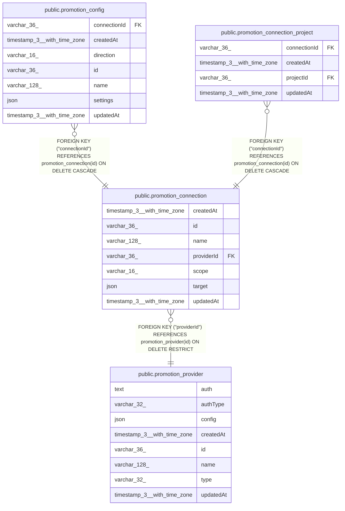

# public.promotion_connection

## Columns

| Name | Type | Default | Nullable | Children | Parents | Comment |
| ---- | ---- | ------- | -------- | -------- | ------- | ------- |
| createdAt | timestamp(3) with time zone | CURRENT_TIMESTAMP(3) | false |  |  |  |
| id | varchar(36) |  | false | [public.promotion_config](public.promotion_config.md) [public.promotion_connection_project](public.promotion_connection_project.md) |  |  |
| name | varchar(128) |  | false |  |  |  |
| providerId | varchar(36) |  | false |  | [public.promotion_provider](public.promotion_provider.md) | The provider whose credentials this connection uses. |
| scope | varchar(16) |  | false |  |  | PromotionConnectionScope enum: "instance", "projects". Cannot change after creation. |
| target | json |  | false |  |  | Where to push and pull, with its own schemaVersion. Plain Git stores the full remote URL. |
| updatedAt | timestamp(3) with time zone | CURRENT_TIMESTAMP(3) | false |  |  |  |

## Constraints

| Name | Type | Definition |
| ---- | ---- | ---------- |
| CHK_promotion_connection_scope | CHECK | CHECK (((scope)::text = ANY ((ARRAY['instance'::character varying, 'projects'::character varying])::text[]))) |
| FK_promotion_connection_providerId | FOREIGN KEY | FOREIGN KEY ("providerId") REFERENCES promotion_provider(id) ON DELETE RESTRICT |
| PK_65cec79aba16950b45592335204 | PRIMARY KEY | PRIMARY KEY (id) |
| promotion_connection_createdAt_not_null | n | NOT NULL "createdAt" |
| promotion_connection_id_not_null | n | NOT NULL id |
| promotion_connection_name_not_null | n | NOT NULL name |
| promotion_connection_providerId_not_null | n | NOT NULL "providerId" |
| promotion_connection_scope_not_null | n | NOT NULL scope |
| promotion_connection_target_not_null | n | NOT NULL target |
| promotion_connection_updatedAt_not_null | n | NOT NULL "updatedAt" |

## Indexes

| Name | Definition |
| ---- | ---------- |
| IDX_9917feaa6ed5705046432b117f | CREATE INDEX "IDX_9917feaa6ed5705046432b117f" ON public.promotion_connection USING btree ("providerId") |
| IDX_promotion_connection_scope | CREATE UNIQUE INDEX "IDX_promotion_connection_scope" ON public.promotion_connection USING btree (scope) WHERE ((scope)::text = 'instance'::text) |
| PK_65cec79aba16950b45592335204 | CREATE UNIQUE INDEX "PK_65cec79aba16950b45592335204" ON public.promotion_connection USING btree (id) |

## Relations

---

> Generated by [tbls](https://github.com/k1LoW/tbls)
