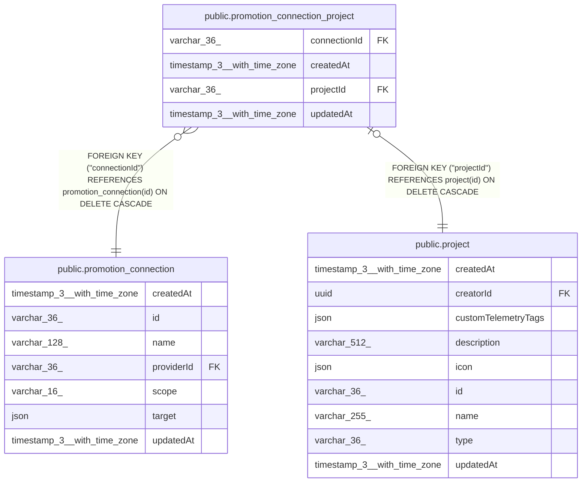

# public.promotion_connection_project

## Columns

| Name | Type | Default | Nullable | Children | Parents | Comment |
| ---- | ---- | ------- | -------- | -------- | ------- | ------- |
| connectionId | varchar(36) |  | false |  | [public.promotion_connection](public.promotion_connection.md) |  |
| createdAt | timestamp(3) with time zone | CURRENT_TIMESTAMP(3) | false |  |  |  |
| projectId | varchar(36) |  | false |  | [public.project](public.project.md) |  |
| updatedAt | timestamp(3) with time zone | CURRENT_TIMESTAMP(3) | false |  |  |  |

## Constraints

| Name | Type | Definition |
| ---- | ---- | ---------- |
| FK_promotion_connection_project_connectionId | FOREIGN KEY | FOREIGN KEY ("connectionId") REFERENCES promotion_connection(id) ON DELETE CASCADE |
| FK_promotion_connection_project_projectId | FOREIGN KEY | FOREIGN KEY ("projectId") REFERENCES project(id) ON DELETE CASCADE |
| PK_0c63d9094bf8ca78349ba860147 | PRIMARY KEY | PRIMARY KEY ("projectId") |
| promotion_connection_project_connectionId_not_null | n | NOT NULL "connectionId" |
| promotion_connection_project_createdAt_not_null | n | NOT NULL "createdAt" |
| promotion_connection_project_projectId_not_null | n | NOT NULL "projectId" |
| promotion_connection_project_updatedAt_not_null | n | NOT NULL "updatedAt" |

## Indexes

| Name | Definition |
| ---- | ---------- |
| IDX_2c579b1068b66359de1b4d2de5 | CREATE INDEX "IDX_2c579b1068b66359de1b4d2de5" ON public.promotion_connection_project USING btree ("connectionId") |
| PK_0c63d9094bf8ca78349ba860147 | CREATE UNIQUE INDEX "PK_0c63d9094bf8ca78349ba860147" ON public.promotion_connection_project USING btree ("projectId") |

## Relations

---

> Generated by [tbls](https://github.com/k1LoW/tbls)
