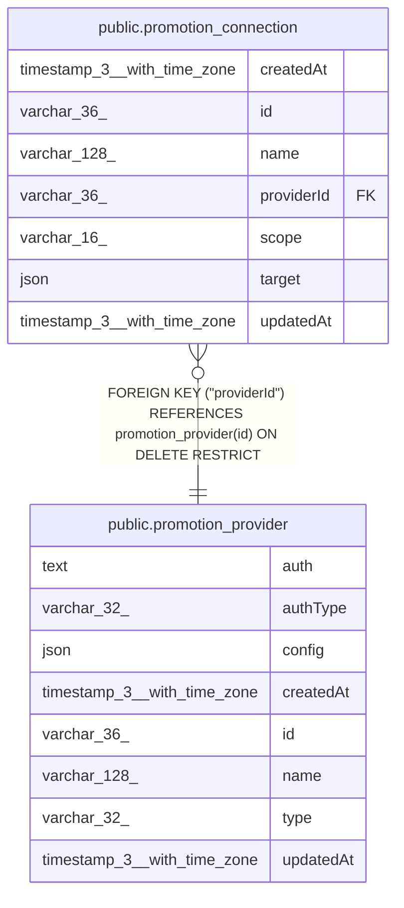

# public.promotion_provider

## Columns

| Name | Type | Default | Nullable | Children | Parents | Comment |
| ---- | ---- | ------- | -------- | -------- | ------- | ------- |
| auth | text |  | false |  |  | Encrypted credentials. Never sent to a client. |
| authType | varchar(32) |  | false |  |  | PromotionProviderAuthType enum: "ssh-key", "token". "token" is an HTTP(S) username and password. |
| config | json |  | false |  |  | Non-secret provider settings, with their own schemaVersion. Validated in code. |
| createdAt | timestamp(3) with time zone | CURRENT_TIMESTAMP(3) | false |  |  |  |
| id | varchar(36) |  | false | [public.promotion_connection](public.promotion_connection.md) |  |  |
| name | varchar(128) |  | false |  |  |  |
| type | varchar(32) |  | false |  |  | PromotionProviderType enum: "git" |
| updatedAt | timestamp(3) with time zone | CURRENT_TIMESTAMP(3) | false |  |  |  |

## Constraints

| Name | Type | Definition |
| ---- | ---- | ---------- |
| CHK_promotion_provider_authType | CHECK | CHECK ((("authType")::text = ANY ((ARRAY['ssh-key'::character varying, 'token'::character varying])::text[]))) |
| CHK_promotion_provider_type | CHECK | CHECK (((type)::text = 'git'::text)) |
| PK_6e968555ff44699f59ad10be765 | PRIMARY KEY | PRIMARY KEY (id) |
| promotion_provider_authType_not_null | n | NOT NULL "authType" |
| promotion_provider_auth_not_null | n | NOT NULL auth |
| promotion_provider_config_not_null | n | NOT NULL config |
| promotion_provider_createdAt_not_null | n | NOT NULL "createdAt" |
| promotion_provider_id_not_null | n | NOT NULL id |
| promotion_provider_name_not_null | n | NOT NULL name |
| promotion_provider_type_not_null | n | NOT NULL type |
| promotion_provider_updatedAt_not_null | n | NOT NULL "updatedAt" |

## Indexes

| Name | Definition |
| ---- | ---------- |
| PK_6e968555ff44699f59ad10be765 | CREATE UNIQUE INDEX "PK_6e968555ff44699f59ad10be765" ON public.promotion_provider USING btree (id) |

## Relations

---

> Generated by [tbls](https://github.com/k1LoW/tbls)
