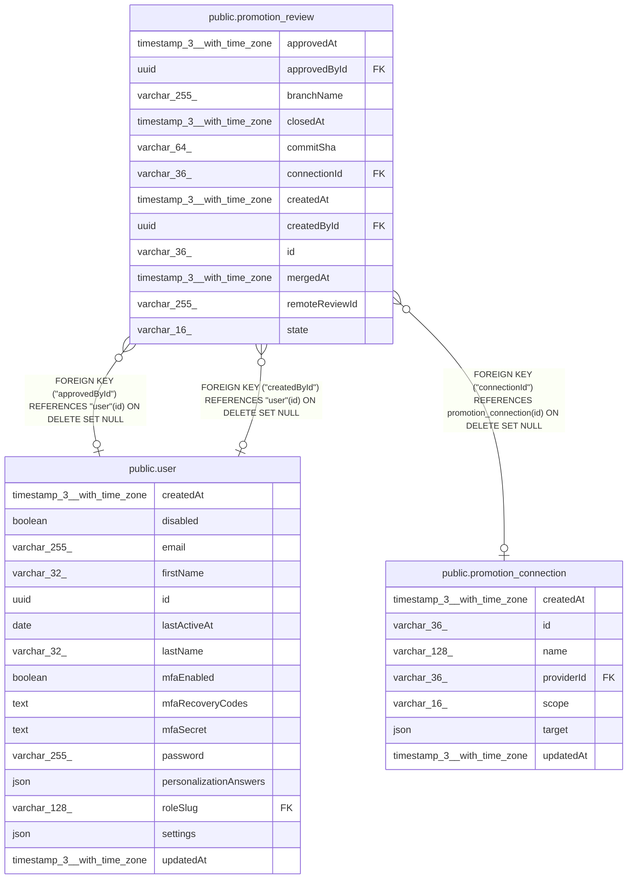

# public.promotion_review

## Columns

| Name | Type | Default | Nullable | Children | Parents | Comment |
| ---- | ---- | ------- | -------- | -------- | ------- | ------- |
| approvedAt | timestamp(3) with time zone |  | true |  |  |  |
| approvedById | uuid |  | true |  | [public.user](public.user.md) | The n8n user who approved the review in n8n. |
| branchName | varchar(255) |  | false |  |  | The promotion branch that was pushed. |
| closedAt | timestamp(3) with time zone |  | true |  |  |  |
| commitSha | varchar(64) |  | false |  |  | The pushed commit. |
| connectionId | varchar(36) |  | true |  | [public.promotion_connection](public.promotion_connection.md) | The connection that pushed the branch. NULL after the connection is deleted. |
| createdAt | timestamp(3) with time zone | CURRENT_TIMESTAMP(3) | false |  |  |  |
| createdById | uuid |  | true |  | [public.user](public.user.md) | The user who ran Promote. |
| id | varchar(36) |  | false |  |  |  |
| mergedAt | timestamp(3) with time zone |  | true |  |  |  |
| remoteReviewId | varchar(255) |  | false |  |  | Opaque reference to the review on the host. The prefix names the host kind, the rest is parsed by that host client, e.g. "gitlab:\<projectId\>!\<iid\>". |
| state | varchar(16) | 'open'::character varying | false |  |  | PromotionReviewState enum: "open", "merged", "closed", "unavailable". Only "open" rows are refreshed from the host. |

## Constraints

| Name | Type | Definition |
| ---- | ---- | ---------- |
| CHK_promotion_review_state | CHECK | CHECK (((state)::text = ANY ((ARRAY['open'::character varying, 'merged'::character varying, 'closed'::character varying, 'unavailable'::character varying])::text[]))) |
| FK_promotion_review_approvedById | FOREIGN KEY | FOREIGN KEY ("approvedById") REFERENCES "user"(id) ON DELETE SET NULL |
| FK_promotion_review_connectionId | FOREIGN KEY | FOREIGN KEY ("connectionId") REFERENCES promotion_connection(id) ON DELETE SET NULL |
| FK_promotion_review_createdById | FOREIGN KEY | FOREIGN KEY ("createdById") REFERENCES "user"(id) ON DELETE SET NULL |
| PK_fe93e2f1add228dc14d3330c8e5 | PRIMARY KEY | PRIMARY KEY (id) |
| promotion_review_branchName_not_null | n | NOT NULL "branchName" |
| promotion_review_commitSha_not_null | n | NOT NULL "commitSha" |
| promotion_review_createdAt_not_null | n | NOT NULL "createdAt" |
| promotion_review_id_not_null | n | NOT NULL id |
| promotion_review_remoteReviewId_not_null | n | NOT NULL "remoteReviewId" |
| promotion_review_state_not_null | n | NOT NULL state |

## Indexes

| Name | Definition |
| ---- | ---------- |
| IDX_promotion_review_connectionId | CREATE INDEX "IDX_promotion_review_connectionId" ON public.promotion_review USING btree ("connectionId") |
| IDX_promotion_review_state_createdAt | CREATE INDEX "IDX_promotion_review_state_createdAt" ON public.promotion_review USING btree (state, "createdAt") |
| PK_fe93e2f1add228dc14d3330c8e5 | CREATE UNIQUE INDEX "PK_fe93e2f1add228dc14d3330c8e5" ON public.promotion_review USING btree (id) |

## Relations

---

> Generated by [tbls](https://github.com/k1LoW/tbls)
