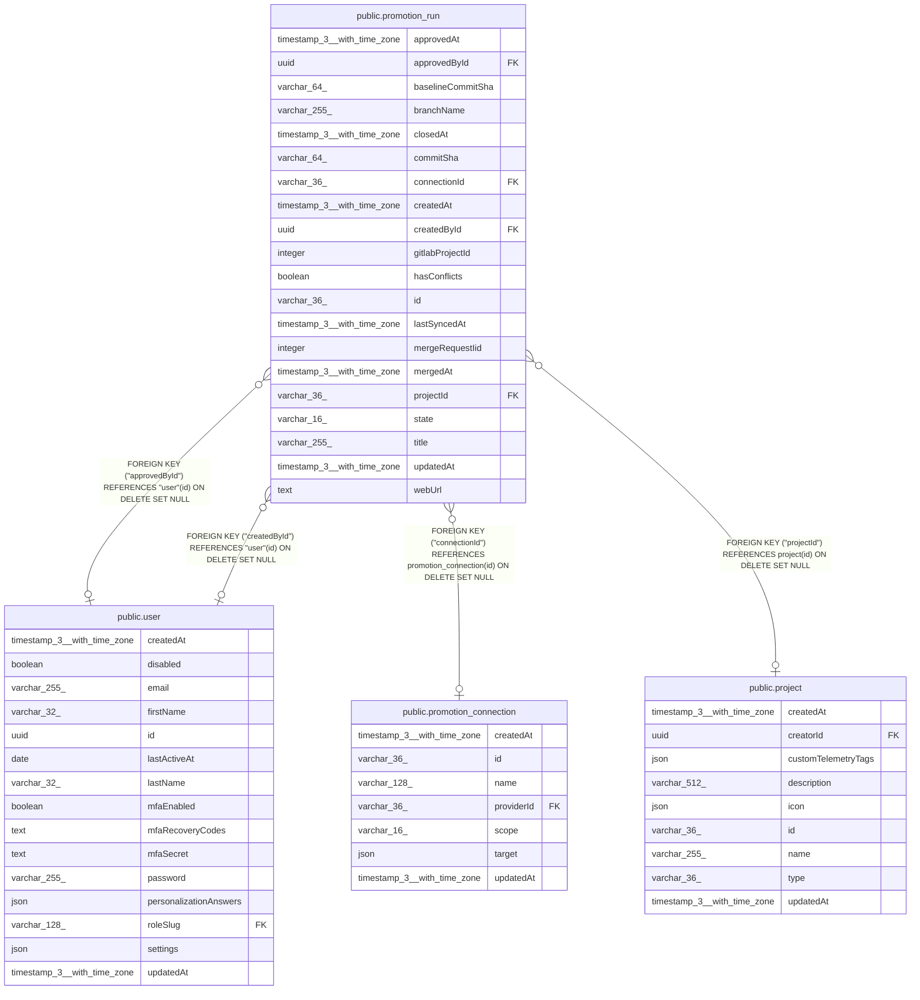

# public.promotion_run

## Columns

| Name | Type | Default | Nullable | Children | Parents | Comment |
| ---- | ---- | ------- | -------- | -------- | ------- | ------- |
| approvedAt | timestamp(3) with time zone |  | true |  |  |  |
| approvedById | uuid |  | true |  | [public.user](public.user.md) | The n8n user who approved the run in n8n. |
| baselineCommitSha | varchar(64) |  | true |  |  | The Review Baseline, frozen when the run leaves "open". NULL while open: computed at read time. |
| branchName | varchar(255) |  | false |  |  | The promotion branch that was pushed. |
| closedAt | timestamp(3) with time zone |  | true |  |  |  |
| commitSha | varchar(64) |  | false |  |  | The pushed commit. |
| connectionId | varchar(36) |  | true |  | [public.promotion_connection](public.promotion_connection.md) | The connection that pushed the run. NULL after the connection is deleted. |
| createdAt | timestamp(3) with time zone | CURRENT_TIMESTAMP(3) | false |  |  |  |
| createdById | uuid |  | true |  | [public.user](public.user.md) | The user who ran Promote. |
| gitlabProjectId | integer |  | false |  |  | Numeric GitLab project id. Stable across repository renames. |
| hasConflicts | boolean | false | false |  |  |  |
| id | varchar(36) |  | false |  |  |  |
| lastSyncedAt | timestamp(3) with time zone |  | true |  |  | When the state was last read from the host. NULL before the first read. |
| mergeRequestIid | integer |  | false |  |  | Merge request iid, scoped to the GitLab project. |
| mergedAt | timestamp(3) with time zone |  | true |  |  |  |
| projectId | varchar(36) |  | true |  | [public.project](public.project.md) | The n8n project of a project-scoped promote. NULL for an instance promote. |
| state | varchar(16) | 'open'::character varying | false |  |  | PromotionRunState enum: "open", "merged", "closed", "unavailable". Only "open" rows are refreshed from the host. |
| title | varchar(255) |  | false |  |  | The merge request title. |
| updatedAt | timestamp(3) with time zone | CURRENT_TIMESTAMP(3) | false |  |  |  |
| webUrl | text |  | false |  |  | Merge request URL on the Git host. |

## Constraints

| Name | Type | Definition |
| ---- | ---- | ---------- |
| CHK_promotion_run_state | CHECK | CHECK (((state)::text = ANY ((ARRAY['open'::character varying, 'merged'::character varying, 'closed'::character varying, 'unavailable'::character varying])::text[]))) |
| FK_promotion_run_approvedById | FOREIGN KEY | FOREIGN KEY ("approvedById") REFERENCES "user"(id) ON DELETE SET NULL |
| FK_promotion_run_connectionId | FOREIGN KEY | FOREIGN KEY ("connectionId") REFERENCES promotion_connection(id) ON DELETE SET NULL |
| FK_promotion_run_createdById | FOREIGN KEY | FOREIGN KEY ("createdById") REFERENCES "user"(id) ON DELETE SET NULL |
| FK_promotion_run_projectId | FOREIGN KEY | FOREIGN KEY ("projectId") REFERENCES project(id) ON DELETE SET NULL |
| PK_f5b941d810bf2eb7a5f8327f446 | PRIMARY KEY | PRIMARY KEY (id) |
| promotion_run_branchName_not_null | n | NOT NULL "branchName" |
| promotion_run_commitSha_not_null | n | NOT NULL "commitSha" |
| promotion_run_createdAt_not_null | n | NOT NULL "createdAt" |
| promotion_run_gitlabProjectId_not_null | n | NOT NULL "gitlabProjectId" |
| promotion_run_hasConflicts_not_null | n | NOT NULL "hasConflicts" |
| promotion_run_id_not_null | n | NOT NULL id |
| promotion_run_mergeRequestIid_not_null | n | NOT NULL "mergeRequestIid" |
| promotion_run_state_not_null | n | NOT NULL state |
| promotion_run_title_not_null | n | NOT NULL title |
| promotion_run_updatedAt_not_null | n | NOT NULL "updatedAt" |
| promotion_run_webUrl_not_null | n | NOT NULL "webUrl" |

## Indexes

| Name | Definition |
| ---- | ---------- |
| IDX_promotion_run_connectionId | CREATE INDEX "IDX_promotion_run_connectionId" ON public.promotion_run USING btree ("connectionId") |
| IDX_promotion_run_state_createdAt | CREATE INDEX "IDX_promotion_run_state_createdAt" ON public.promotion_run USING btree (state, "createdAt") |
| PK_f5b941d810bf2eb7a5f8327f446 | CREATE UNIQUE INDEX "PK_f5b941d810bf2eb7a5f8327f446" ON public.promotion_run USING btree (id) |

## Relations

---

> Generated by [tbls](https://github.com/k1LoW/tbls)
