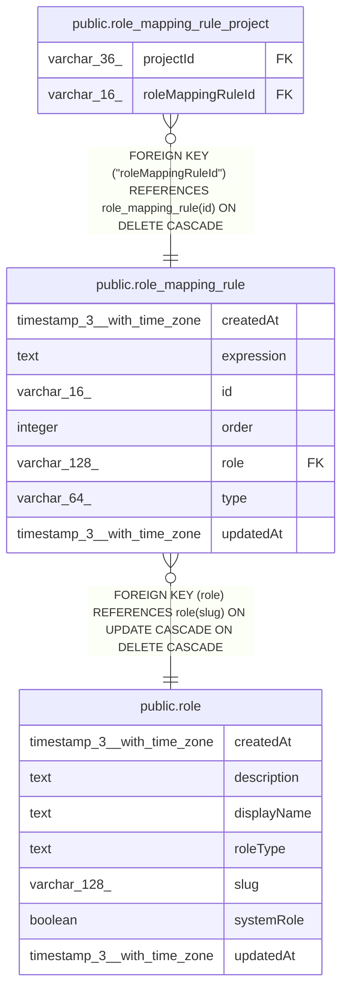

# public.role_mapping_rule

## Columns

| Name | Type | Default | Nullable | Children | Parents | Comment |
| ---- | ---- | ------- | -------- | -------- | ------- | ------- |
| createdAt | timestamp(3) with time zone | CURRENT_TIMESTAMP(3) | false |  |  |  |
| expression | text |  | false |  |  |  |
| id | varchar(16) |  | false | [public.role_mapping_rule_project](public.role_mapping_rule_project.md) |  |  |
| order | integer |  | false |  |  |  |
| role | varchar(128) |  | false |  | [public.role](public.role.md) |  |
| type | varchar(64) |  | false |  |  | Expected values: 'instance' (maps to a global role) or 'project' (maps to a project role; projects linked via role_mapping_rule_project). |
| updatedAt | timestamp(3) with time zone | CURRENT_TIMESTAMP(3) | false |  |  |  |

## Constraints

| Name | Type | Definition |
| ---- | ---- | ---------- |
| FK_bb66e404c35996b0d6946177501 | FOREIGN KEY | FOREIGN KEY (role) REFERENCES role(slug) ON UPDATE CASCADE ON DELETE CASCADE |
| PK_d772c8ec1a89b52d31c882bc560 | PRIMARY KEY | PRIMARY KEY (id) |
| UQ_b33ac896ad3099fc8de36fdc1c4 | UNIQUE | UNIQUE (type, "order") |
| role_mapping_rule_createdAt_not_null | n | NOT NULL "createdAt" |
| role_mapping_rule_expression_not_null | n | NOT NULL expression |
| role_mapping_rule_id_not_null | n | NOT NULL id |
| role_mapping_rule_order_not_null | n | NOT NULL "order" |
| role_mapping_rule_role_not_null | n | NOT NULL role |
| role_mapping_rule_type_not_null | n | NOT NULL type |
| role_mapping_rule_updatedAt_not_null | n | NOT NULL "updatedAt" |

## Indexes

| Name | Definition |
| ---- | ---------- |
| IDX_bb66e404c35996b0d694617750 | CREATE INDEX "IDX_bb66e404c35996b0d694617750" ON public.role_mapping_rule USING btree (role) |
| PK_d772c8ec1a89b52d31c882bc560 | CREATE UNIQUE INDEX "PK_d772c8ec1a89b52d31c882bc560" ON public.role_mapping_rule USING btree (id) |
| UQ_b33ac896ad3099fc8de36fdc1c4 | CREATE UNIQUE INDEX "UQ_b33ac896ad3099fc8de36fdc1c4" ON public.role_mapping_rule USING btree (type, "order") |

## Relations

---

> Generated by [tbls](https://github.com/k1LoW/tbls)
