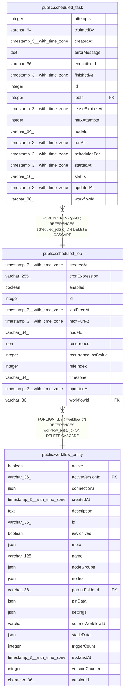

# public.scheduled_job

## Columns

| Name | Type | Default | Nullable | Children | Parents | Comment |
| ---- | ---- | ------- | -------- | -------- | ------- | ------- |
| createdAt | timestamp(3) with time zone | CURRENT_TIMESTAMP(3) | false |  |  |  |
| cronExpression | varchar(255) |  | false |  |  | Six-field cron expression evaluated using timezone |
| enabled | boolean | false | false |  |  |  |
| id | integer |  | false | [public.scheduled_task](public.scheduled_task.md) |  |  |
| lastFiredAt | timestamp(3) with time zone |  | true |  |  | Most recent materialized occurrence time |
| nextRunAt | timestamp(3) with time zone |  | true |  |  | Next canonical occurrence time to materialize |
| nodeId | varchar(64) |  | false |  |  | Schedule Trigger node ID within the active workflow version |
| recurrence | json |  | true |  |  | Optional recurrence filter for interval rules cron cannot express exactly |
| recurrenceLastValue | integer |  | true |  |  | Last accepted recurrence bucket, e.g. hour, day-of-year, week, or month |
| ruleIndex | integer |  | false |  |  | Index of the trigger rule within the Schedule Trigger node |
| timezone | varchar(64) |  | false |  |  | IANA timezone used for schedule evaluation |
| updatedAt | timestamp(3) with time zone | CURRENT_TIMESTAMP(3) | false |  |  |  |
| workflowId | varchar(36) |  | false |  | [public.workflow_entity](public.workflow_entity.md) | Workflow whose active Schedule Trigger rule owns this schedule |

## Constraints

| Name | Type | Definition |
| ---- | ---- | ---------- |
| FK_74fa940fef7c40128383b2c4b82 | FOREIGN KEY | FOREIGN KEY ("workflowId") REFERENCES workflow_entity(id) ON DELETE CASCADE |
| PK_893185383f029ca8d57bb781fa8 | PRIMARY KEY | PRIMARY KEY (id) |
| scheduled_job_createdAt_not_null | n | NOT NULL "createdAt" |
| scheduled_job_cronExpression_not_null | n | NOT NULL "cronExpression" |
| scheduled_job_enabled_not_null | n | NOT NULL enabled |
| scheduled_job_id_not_null | n | NOT NULL id |
| scheduled_job_nodeId_not_null | n | NOT NULL "nodeId" |
| scheduled_job_ruleIndex_not_null | n | NOT NULL "ruleIndex" |
| scheduled_job_timezone_not_null | n | NOT NULL timezone |
| scheduled_job_updatedAt_not_null | n | NOT NULL "updatedAt" |
| scheduled_job_workflowId_not_null | n | NOT NULL "workflowId" |

## Indexes

| Name | Definition |
| ---- | ---------- |
| IDX_189f2b3ce8a0952d66e1937a0c | CREATE INDEX "IDX_189f2b3ce8a0952d66e1937a0c" ON public.scheduled_job USING btree ("workflowId", "nodeId") |
| IDX_ce6bd6203b012d6bf7977b3868 | CREATE INDEX "IDX_ce6bd6203b012d6bf7977b3868" ON public.scheduled_job USING btree (enabled, "nextRunAt") |
| IDX_scheduled_job_workflowId_nodeId_ruleIndex | CREATE UNIQUE INDEX "IDX_scheduled_job_workflowId_nodeId_ruleIndex" ON public.scheduled_job USING btree ("workflowId", "nodeId", "ruleIndex") |
| PK_893185383f029ca8d57bb781fa8 | CREATE UNIQUE INDEX "PK_893185383f029ca8d57bb781fa8" ON public.scheduled_job USING btree (id) |

## Relations

---

> Generated by [tbls](https://github.com/k1LoW/tbls)
