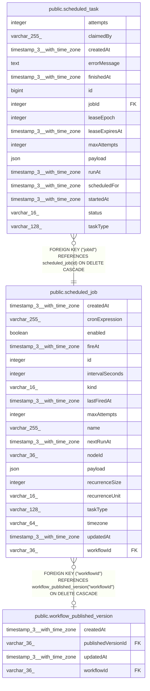

# public.scheduled_job

## Columns

| Name | Type | Default | Nullable | Children | Parents | Comment |
| ---- | ---- | ------- | -------- | -------- | ------- | ------- |
| createdAt | timestamp(3) with time zone | CURRENT_TIMESTAMP(3) | false |  |  |  |
| cronExpression | varchar(255) |  | true |  |  | Cron expression. For kind 'cron' it is the schedule; for 'recurring_cron' it lists the candidate run times that the every-N-periods filter then keeps every Nth of. |
| enabled | boolean | true | false |  |  | Whether the scheduler considers this job for firing. |
| fireAt | timestamp(3) with time zone |  | true |  |  | Absolute time the job fires once; set only when kind is 'one_off'. |
| id | integer |  | false | [public.scheduled_task](public.scheduled_task.md) |  |  |
| intervalSeconds | integer |  | true |  |  | Gap between fires in seconds; set only when kind is 'interval'. |
| kind | varchar(16) |  | false |  |  | Recurrence kind; selects which of the schedule columns below apply. |
| lastFiredAt | timestamp(3) with time zone |  | true |  |  | Last time an occurrence was materialized; used to recompute nextRunAt. |
| maxAttempts | integer | 1 | false |  |  | Retry ceiling copied onto each occurrence this job materializes. |
| name | varchar(255) |  | false |  |  | Human-readable job name. A well-known scheduler key for system jobs; generated for workflow trigger jobs. |
| nextRunAt | timestamp(3) with time zone |  | true |  |  | Next time an occurrence is due; the scheduler sweep reads this to find work. NULL once disabled or a one-off has fired. |
| nodeId | varchar(36) |  | true |  |  | Trigger node within the workflow that owns this job; NULL for non-trigger jobs. |
| payload | json | '{}'::json | false |  |  | Input passed to the task handler when an occurrence runs. |
| recurrenceSize | integer |  | true |  |  | The N in a recurring_cron schedule's every-N-periods filter, e.g. 3 for every 3 weeks; at least 2. Set only when kind is 'recurring_cron'. |
| recurrenceUnit | varchar(16) |  | true |  |  | Calendar period counted by a recurring_cron schedule's every-N-periods filter (hours, days, weeks, months). Set only when kind is 'recurring_cron'. |
| taskType | varchar(128) |  | false |  |  | Selects which registered handler runs the task. |
| timezone | varchar(64) |  | true |  |  | IANA timezone the cron expression is evaluated in; NULL uses the instance default. |
| updatedAt | timestamp(3) with time zone | CURRENT_TIMESTAMP(3) | false |  |  |  |
| workflowId | varchar(36) |  | true |  | [public.workflow_published_version](public.workflow_published_version.md) | References the workflow's published version, since only published trigger nodes get scheduled; NULL for system jobs not tied to a workflow. Unpublishing the workflow deletes its jobs. |

## Constraints

| Name | Type | Definition |
| ---- | ---- | ---------- |
| CHK_scheduled_job_cron_expression | CHECK | CHECK ((((kind)::text <> 'cron'::text) OR ("cronExpression" IS NOT NULL))) |
| CHK_scheduled_job_fire_at | CHECK | CHECK ((((kind)::text <> 'one_off'::text) OR ("fireAt" IS NOT NULL))) |
| CHK_scheduled_job_interval_seconds | CHECK | CHECK ((((kind)::text <> 'interval'::text) OR ("intervalSeconds" IS NOT NULL))) |
| CHK_scheduled_job_kind | CHECK | CHECK (((kind)::text = ANY ((ARRAY['cron'::character varying, 'interval'::character varying, 'one_off'::character varying, 'recurring_cron'::character varying])::text[]))) |
| CHK_scheduled_job_recurrence_size | CHECK | CHECK (("recurrenceSize" >= 2)) |
| CHK_scheduled_job_recurrence_unit | CHECK | CHECK ((("recurrenceUnit")::text = ANY ((ARRAY['hours'::character varying, 'days'::character varying, 'weeks'::character varying, 'months'::character varying])::text[]))) |
| CHK_scheduled_job_recurring_cron | CHECK | CHECK ((((kind)::text <> 'recurring_cron'::text) OR (("cronExpression" IS NOT NULL) AND ("recurrenceUnit" IS NOT NULL) AND ("recurrenceSize" IS NOT NULL)))) |
| FK_scheduled_job_workflowId | FOREIGN KEY | FOREIGN KEY ("workflowId") REFERENCES workflow_published_version("workflowId") ON DELETE CASCADE |
| PK_893185383f029ca8d57bb781fa8 | PRIMARY KEY | PRIMARY KEY (id) |
| scheduled_job_createdAt_not_null | n | NOT NULL "createdAt" |
| scheduled_job_enabled_not_null | n | NOT NULL enabled |
| scheduled_job_id_not_null | n | NOT NULL id |
| scheduled_job_kind_not_null | n | NOT NULL kind |
| scheduled_job_maxAttempts_not_null | n | NOT NULL "maxAttempts" |
| scheduled_job_name_not_null | n | NOT NULL name |
| scheduled_job_payload_not_null | n | NOT NULL payload |
| scheduled_job_taskType_not_null | n | NOT NULL "taskType" |
| scheduled_job_updatedAt_not_null | n | NOT NULL "updatedAt" |

## Indexes

| Name | Definition |
| ---- | ---------- |
| IDX_scheduled_job_name | CREATE UNIQUE INDEX "IDX_scheduled_job_name" ON public.scheduled_job USING btree (name) |
| IDX_scheduled_job_nextRunAt | CREATE INDEX "IDX_scheduled_job_nextRunAt" ON public.scheduled_job USING btree ("nextRunAt") WHERE ((enabled = true) AND ("nextRunAt" IS NOT NULL)) |
| IDX_scheduled_job_workflowId | CREATE INDEX "IDX_scheduled_job_workflowId" ON public.scheduled_job USING btree ("workflowId") WHERE ("workflowId" IS NOT NULL) |
| PK_893185383f029ca8d57bb781fa8 | CREATE UNIQUE INDEX "PK_893185383f029ca8d57bb781fa8" ON public.scheduled_job USING btree (id) |

## Relations

---

> Generated by [tbls](https://github.com/k1LoW/tbls)
