# public.scheduled_job

## Columns

| Name | Type | Default | Nullable | Children | Parents | Comment |
| ---- | ---- | ------- | -------- | -------- | ------- | ------- |
| createdAt | timestamp(3) with time zone | CURRENT_TIMESTAMP(3) | false |  |  |  |
| cronExpression | varchar(255) |  | true |  |  | Cron expression driving recurrence; set only when kind is 'cron'. |
| enabled | boolean | true | false |  |  | Whether the scheduler considers this job for firing. |
| fireAt | timestamp(3) with time zone |  | true |  |  | Absolute time the job fires once; set only when kind is 'one_off'. |
| id | integer |  | false | [public.scheduled_task](public.scheduled_task.md) |  |  |
| intervalSeconds | integer |  | true |  |  | Gap between fires in seconds; set only when kind is 'interval'. |
| kind | varchar(16) |  | false |  |  | Recurrence kind; selects which of the schedule columns below apply. |
| lastFiredAt | timestamp(3) with time zone |  | true |  |  | Last time an occurrence was materialized; used to recompute nextRunAt. |
| maxAttempts | integer | 1 | false |  |  | Retry ceiling copied onto each occurrence this job materializes. |
| misfireGraceSeconds | integer | 60 | false |  |  | How late a fire may be before it counts as missed and the misfire policy applies. |
| misfirePolicy | varchar(16) | 'coalesce'::character varying | false |  |  | What to do with fires that were missed while the scheduler was down. |
| name | varchar(255) |  | true |  |  | Well-known scheduler key, e.g. a system job. NULL when the job is owned by a workflow trigger instead. |
| nextRunAt | timestamp(3) with time zone |  | true |  |  | Next time an occurrence is due; the scheduler sweep reads this to find work. NULL once disabled or a one-off has fired. |
| nodeId | varchar(36) |  | true |  |  | Trigger node within the workflow that owns this job; NULL for non-trigger jobs. |
| payload | json | '{}'::json | false |  |  | Input passed to the task handler when an occurrence runs. |
| taskType | varchar(128) |  | false |  |  | Selects which registered handler runs the task. |
| timezone | varchar(64) |  | true |  |  | IANA timezone the cron expression is evaluated in; NULL uses the instance default. |
| updatedAt | timestamp(3) with time zone | CURRENT_TIMESTAMP(3) | false |  |  |  |
| workflowId | varchar(36) |  | true |  | [public.workflow_entity](public.workflow_entity.md) | Workflow this job belongs to; NULL for system jobs not tied to a workflow. Deleting the workflow deletes its jobs. |

## Constraints

| Name | Type | Definition |
| ---- | ---- | ---------- |
| CHK_scheduled_job_kind | CHECK | CHECK (((kind)::text = ANY ((ARRAY['cron'::character varying, 'interval'::character varying, 'one_off'::character varying])::text[]))) |
| CHK_scheduled_job_misfirePolicy | CHECK | CHECK ((("misfirePolicy")::text = ANY ((ARRAY['coalesce'::character varying, 'skip'::character varying, 'fire_all'::character varying])::text[]))) |
| FK_scheduled_job_workflowId | FOREIGN KEY | FOREIGN KEY ("workflowId") REFERENCES workflow_entity(id) ON DELETE CASCADE |
| PK_893185383f029ca8d57bb781fa8 | PRIMARY KEY | PRIMARY KEY (id) |
| scheduled_job_createdAt_not_null | n | NOT NULL "createdAt" |
| scheduled_job_enabled_not_null | n | NOT NULL enabled |
| scheduled_job_id_not_null | n | NOT NULL id |
| scheduled_job_kind_not_null | n | NOT NULL kind |
| scheduled_job_maxAttempts_not_null | n | NOT NULL "maxAttempts" |
| scheduled_job_misfireGraceSeconds_not_null | n | NOT NULL "misfireGraceSeconds" |
| scheduled_job_misfirePolicy_not_null | n | NOT NULL "misfirePolicy" |
| scheduled_job_payload_not_null | n | NOT NULL payload |
| scheduled_job_taskType_not_null | n | NOT NULL "taskType" |
| scheduled_job_updatedAt_not_null | n | NOT NULL "updatedAt" |

## Indexes

| Name | Definition |
| ---- | ---------- |
| IDX_scheduled_job_due | CREATE INDEX "IDX_scheduled_job_due" ON public.scheduled_job USING btree ("nextRunAt") WHERE ((enabled = true) AND ("nextRunAt" IS NOT NULL)) |
| IDX_scheduled_job_workflow | CREATE INDEX "IDX_scheduled_job_workflow" ON public.scheduled_job USING btree ("workflowId", "nodeId") |
| PK_893185383f029ca8d57bb781fa8 | CREATE UNIQUE INDEX "PK_893185383f029ca8d57bb781fa8" ON public.scheduled_job USING btree (id) |

## Relations

```mermaid
erDiagram

"public.scheduled_task" }o--|| "public.scheduled_job" : "FOREIGN KEY (#quot;jobId#quot;) REFERENCES scheduled_job(id) ON DELETE CASCADE"
"public.scheduled_job" }o--o| "public.workflow_entity" : "FOREIGN KEY (#quot;workflowId#quot;) REFERENCES workflow_entity(id) ON DELETE CASCADE"

"public.scheduled_job" {
  timestamp_3__with_time_zone createdAt
  varchar_255_ cronExpression
  boolean enabled
  timestamp_3__with_time_zone fireAt
  integer id
  integer intervalSeconds
  varchar_16_ kind
  timestamp_3__with_time_zone lastFiredAt
  integer maxAttempts
  integer misfireGraceSeconds
  varchar_16_ misfirePolicy
  varchar_255_ name
  timestamp_3__with_time_zone nextRunAt
  varchar_36_ nodeId
  json payload
  varchar_128_ taskType
  varchar_64_ timezone
  timestamp_3__with_time_zone updatedAt
  varchar_36_ workflowId FK
}
"public.scheduled_task" {
  integer attempts
  varchar_255_ claimedBy
  timestamp_3__with_time_zone createdAt
  text errorMessage
  timestamp_3__with_time_zone finishedAt
  bigint id
  integer jobId FK
  integer leaseEpoch
  timestamp_3__with_time_zone leaseExpiresAt
  integer maxAttempts
  json payload
  timestamp_3__with_time_zone runAt
  timestamp_3__with_time_zone scheduledFor
  timestamp_3__with_time_zone startedAt
  varchar_16_ status
  varchar_128_ taskType
}
"public.workflow_entity" {
  boolean active
  varchar_36_ activeVersionId FK
  json connections
  timestamp_3__with_time_zone createdAt
  text description
  varchar_36_ id
  boolean isArchived
  json meta
  varchar_128_ name
  json nodeGroups
  json nodes
  varchar_36_ parentFolderId FK
  json pinData
  json settings
  varchar sourceWorkflowId
  json staticData
  integer triggerCount
  timestamp_3__with_time_zone updatedAt
  integer versionCounter
  character_36_ versionId
}
```

---

> Generated by [tbls](https://github.com/k1LoW/tbls)
