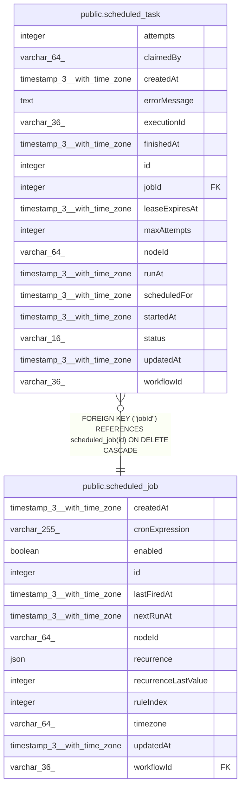

# public.scheduled_task

## Columns

| Name | Type | Default | Nullable | Children | Parents | Comment |
| ---- | ---- | ------- | -------- | -------- | ------- | ------- |
| attempts | integer | 0 | false |  |  |  |
| claimedBy | varchar(64) |  | true |  |  | Host ID of the main instance that claimed the task |
| createdAt | timestamp(3) with time zone | CURRENT_TIMESTAMP(3) | false |  |  |  |
| errorMessage | text |  | true |  |  |  |
| executionId | varchar(36) |  | true |  |  | Execution ID created during successful handoff |
| finishedAt | timestamp(3) with time zone |  | true |  |  |  |
| id | integer |  | false |  |  |  |
| jobId | integer |  | false |  | [public.scheduled_job](public.scheduled_job.md) | Scheduled job that materialized this occurrence |
| leaseExpiresAt | timestamp(3) with time zone |  | true |  |  | When a running claim may be retried |
| maxAttempts | integer | 1 | false |  |  |  |
| nodeId | varchar(64) |  | false |  |  | Denormalized Schedule Trigger node ID for execution handoff |
| runAt | timestamp(3) with time zone |  | false |  |  | Time after which executors may claim the task |
| scheduledFor | timestamp(3) with time zone |  | false |  |  | Canonical occurrence instant in UTC |
| startedAt | timestamp(3) with time zone |  | true |  |  |  |
| status | varchar(16) |  | false |  |  |  |
| updatedAt | timestamp(3) with time zone | CURRENT_TIMESTAMP(3) | false |  |  |  |
| workflowId | varchar(36) |  | false |  |  | Denormalized workflow ID for execution handoff and cleanup |

## Constraints

| Name | Type | Definition |
| ---- | ---- | ---------- |
| CHK_scheduled_task_status | CHECK | CHECK (((status)::text = ANY ((ARRAY['pending'::character varying, 'running'::character varying, 'succeeded'::character varying, 'failed'::character varying, 'cancelled'::character varying])::text[]))) |
| FK_fd05e45e6835cec2ae9cc65d93a | FOREIGN KEY | FOREIGN KEY ("jobId") REFERENCES scheduled_job(id) ON DELETE CASCADE |
| PK_d690af24e57e30594c1948af1e6 | PRIMARY KEY | PRIMARY KEY (id) |
| scheduled_task_attempts_not_null | n | NOT NULL attempts |
| scheduled_task_createdAt_not_null | n | NOT NULL "createdAt" |
| scheduled_task_id_not_null | n | NOT NULL id |
| scheduled_task_jobId_not_null | n | NOT NULL "jobId" |
| scheduled_task_maxAttempts_not_null | n | NOT NULL "maxAttempts" |
| scheduled_task_nodeId_not_null | n | NOT NULL "nodeId" |
| scheduled_task_runAt_not_null | n | NOT NULL "runAt" |
| scheduled_task_scheduledFor_not_null | n | NOT NULL "scheduledFor" |
| scheduled_task_status_not_null | n | NOT NULL status |
| scheduled_task_updatedAt_not_null | n | NOT NULL "updatedAt" |
| scheduled_task_workflowId_not_null | n | NOT NULL "workflowId" |

## Indexes

| Name | Definition |
| ---- | ---------- |
| IDX_084afc4270f40eb355f00dcb3a | CREATE INDEX "IDX_084afc4270f40eb355f00dcb3a" ON public.scheduled_task USING btree ("workflowId", "nodeId") |
| IDX_451ab24712630456cba4ba77a8 | CREATE INDEX "IDX_451ab24712630456cba4ba77a8" ON public.scheduled_task USING btree (status, "runAt") |
| IDX_a4e8a80bc8ce25121a770287f8 | CREATE INDEX "IDX_a4e8a80bc8ce25121a770287f8" ON public.scheduled_task USING btree (status, "leaseExpiresAt") |
| IDX_fd05e45e6835cec2ae9cc65d93 | CREATE INDEX "IDX_fd05e45e6835cec2ae9cc65d93" ON public.scheduled_task USING btree ("jobId") |
| IDX_scheduled_task_jobId_scheduledFor | CREATE UNIQUE INDEX "IDX_scheduled_task_jobId_scheduledFor" ON public.scheduled_task USING btree ("jobId", "scheduledFor") |
| PK_d690af24e57e30594c1948af1e6 | CREATE UNIQUE INDEX "PK_d690af24e57e30594c1948af1e6" ON public.scheduled_task USING btree (id) |

## Relations

---

> Generated by [tbls](https://github.com/k1LoW/tbls)
