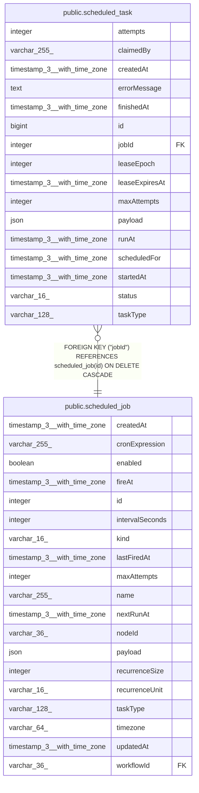

# public.scheduled_task

## Columns

| Name | Type | Default | Nullable | Children | Parents | Comment |
| ---- | ---- | ------- | -------- | -------- | ------- | ------- |
| attempts | integer | 0 | false |  |  | Execution attempts started so far; compared against maxAttempts. |
| claimedBy | varchar(255) |  | true |  |  | Id of the instance currently holding the lease; NULL when unclaimed. |
| createdAt | timestamp(3) with time zone | CURRENT_TIMESTAMP(3) | false |  |  |  |
| errorMessage | text |  | true |  |  | Failure detail from the last attempt. |
| finishedAt | timestamp(3) with time zone |  | true |  |  | When the occurrence reached a terminal state; drives retention pruning. |
| id | bigint |  | false |  |  |  |
| jobId | integer |  | false |  | [public.scheduled_job](public.scheduled_job.md) | The scheduled_job this occurrence belongs to. |
| leaseEpoch | integer | 0 | false |  |  | Fencing token bumped on each claim; lets a reaped worker detect it lost ownership and not overwrite the new owner's results. |
| leaseExpiresAt | timestamp(3) with time zone |  | true |  |  | When the current lease expires; the reaper reclaims running occurrences past this. |
| maxAttempts | integer | 1 | false |  |  | Attempt ceiling; once attempts reaches it, a failure is final rather than retried. |
| payload | json | '{}'::json | false |  |  | Handler input copied from the job. A snapshot, so editing the job later doesn't change runs already queued. |
| runAt | timestamp(3) with time zone |  | false |  |  | Earliest time the executor may pick this up; starts at scheduledFor and is pushed out by retry backoff. |
| scheduledFor | timestamp(3) with time zone |  | false |  |  | The logical fire time this occurrence represents; unique per job, so the same instant cannot be queued twice. |
| startedAt | timestamp(3) with time zone |  | true |  |  | When the current attempt started running. |
| status | varchar(16) | 'pending'::character varying | false |  |  | Lifecycle state; drives which occurrences the claim and reaper scans consider. |
| taskType | varchar(128) |  | false |  |  | What kind of work to run, copied from the job so a run is self-contained (no join to execute it). Also lets a run exist without a parent job in future. |

## Constraints

| Name | Type | Definition |
| ---- | ---- | ---------- |
| CHK_scheduled_task_running_lease | CHECK | CHECK ((((status)::text <> 'running'::text) OR ("leaseExpiresAt" IS NOT NULL))) |
| CHK_scheduled_task_status | CHECK | CHECK (((status)::text = ANY ((ARRAY['pending'::character varying, 'running'::character varying, 'succeeded'::character varying, 'failed'::character varying, 'missed'::character varying, 'cancelled'::character varying])::text[]))) |
| FK_scheduled_task_jobId | FOREIGN KEY | FOREIGN KEY ("jobId") REFERENCES scheduled_job(id) ON DELETE CASCADE |
| PK_d690af24e57e30594c1948af1e6 | PRIMARY KEY | PRIMARY KEY (id) |
| scheduled_task_attempts_not_null | n | NOT NULL attempts |
| scheduled_task_createdAt_not_null | n | NOT NULL "createdAt" |
| scheduled_task_id_not_null | n | NOT NULL id |
| scheduled_task_jobId_not_null | n | NOT NULL "jobId" |
| scheduled_task_leaseEpoch_not_null | n | NOT NULL "leaseEpoch" |
| scheduled_task_maxAttempts_not_null | n | NOT NULL "maxAttempts" |
| scheduled_task_payload_not_null | n | NOT NULL payload |
| scheduled_task_runAt_not_null | n | NOT NULL "runAt" |
| scheduled_task_scheduledFor_not_null | n | NOT NULL "scheduledFor" |
| scheduled_task_status_not_null | n | NOT NULL status |
| scheduled_task_taskType_not_null | n | NOT NULL "taskType" |

## Indexes

| Name | Definition |
| ---- | ---------- |
| IDX_scheduled_task_finishedAt | CREATE INDEX "IDX_scheduled_task_finishedAt" ON public.scheduled_task USING btree ("finishedAt") WHERE ("finishedAt" IS NOT NULL) |
| IDX_scheduled_task_jobId_scheduledFor | CREATE UNIQUE INDEX "IDX_scheduled_task_jobId_scheduledFor" ON public.scheduled_task USING btree ("jobId", "scheduledFor") |
| IDX_scheduled_task_leaseExpiresAt | CREATE INDEX "IDX_scheduled_task_leaseExpiresAt" ON public.scheduled_task USING btree ("leaseExpiresAt") WHERE ((status)::text = 'running'::text) |
| IDX_scheduled_task_runAt | CREATE INDEX "IDX_scheduled_task_runAt" ON public.scheduled_task USING btree ("runAt") WHERE ((status)::text = 'pending'::text) |
| PK_d690af24e57e30594c1948af1e6 | CREATE UNIQUE INDEX "PK_d690af24e57e30594c1948af1e6" ON public.scheduled_task USING btree (id) |

## Relations

---

> Generated by [tbls](https://github.com/k1LoW/tbls)
