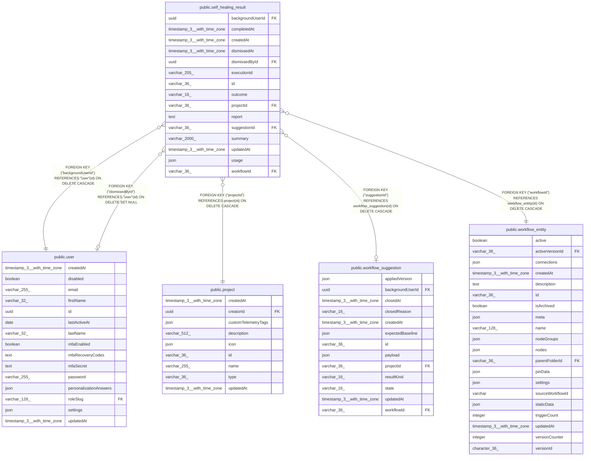

# public.self_healing_result

## Columns

| Name | Type | Default | Nullable | Children | Parents | Comment |
| ---- | ---- | ------- | -------- | -------- | ------- | ------- |
| backgroundUserId | uuid |  | false |  | [public.user](public.user.md) | User who enabled the investigation |
| completedAt | timestamp(3) with time zone |  | false |  |  |  |
| createdAt | timestamp(3) with time zone | CURRENT_TIMESTAMP(3) | false |  |  |  |
| dismissedAt | timestamp(3) with time zone |  | true |  |  |  |
| dismissedById | uuid |  | true |  | [public.user](public.user.md) | Reviewer who dismissed the result |
| executionId | varchar(255) |  | false |  |  | Execution reference retained after pruning; also supports the external v2 data plane |
| id | varchar(36) |  | false |  |  |  |
| outcome | varchar(16) |  | false |  |  | Accepted investigation outcome, separate from review closure |
| projectId | varchar(36) |  | false |  | [public.project](public.project.md) | Original workflow owner project |
| report | text |  | false |  |  | Saved report, independent of execution and chat data |
| suggestionId | varchar(36) |  | true |  | [public.workflow_suggestion](public.workflow_suggestion.md) | Optional isolated workflow suggestion |
| summary | varchar(2000) |  | false |  |  |  |
| updatedAt | timestamp(3) with time zone | CURRENT_TIMESTAMP(3) | false |  |  |  |
| usage | json |  | false |  |  | Recorded runtime and accounting usage; null measurements mean unknown |
| workflowId | varchar(36) |  | false |  | [public.workflow_entity](public.workflow_entity.md) | Investigated workflow |

## Constraints

| Name | Type | Definition |
| ---- | ---- | ---------- |
| CHK_self_healing_result_outcome | CHECK | CHECK (((outcome)::text = ANY ((ARRAY['fix_ready'::character varying, 'needs_you'::character varying, 'could_not_fix'::character varying])::text[]))) |
| FK_3cb48b62bf261b7a6da666fee2d | FOREIGN KEY | FOREIGN KEY ("projectId") REFERENCES project(id) ON DELETE CASCADE |
| FK_738c3c0198c5ad104645a14fdc1 | FOREIGN KEY | FOREIGN KEY ("suggestionId") REFERENCES workflow_suggestion(id) ON DELETE CASCADE |
| FK_8366669b58b0f63a07cf2bbffcc | FOREIGN KEY | FOREIGN KEY ("backgroundUserId") REFERENCES "user"(id) ON DELETE CASCADE |
| FK_98095dea3ff814d4ee37a1380e6 | FOREIGN KEY | FOREIGN KEY ("dismissedById") REFERENCES "user"(id) ON DELETE SET NULL |
| FK_9a3fe8a8f872917949d8de1bb4a | FOREIGN KEY | FOREIGN KEY ("workflowId") REFERENCES workflow_entity(id) ON DELETE CASCADE |
| PK_0a772d117fddff1eaf6a759e1b6 | PRIMARY KEY | PRIMARY KEY (id) |
| self_healing_result_backgroundUserId_not_null | n | NOT NULL "backgroundUserId" |
| self_healing_result_completedAt_not_null | n | NOT NULL "completedAt" |
| self_healing_result_createdAt_not_null | n | NOT NULL "createdAt" |
| self_healing_result_executionId_not_null | n | NOT NULL "executionId" |
| self_healing_result_id_not_null | n | NOT NULL id |
| self_healing_result_outcome_not_null | n | NOT NULL outcome |
| self_healing_result_projectId_not_null | n | NOT NULL "projectId" |
| self_healing_result_report_not_null | n | NOT NULL report |
| self_healing_result_summary_not_null | n | NOT NULL summary |
| self_healing_result_updatedAt_not_null | n | NOT NULL "updatedAt" |
| self_healing_result_usage_not_null | n | NOT NULL usage |
| self_healing_result_workflowId_not_null | n | NOT NULL "workflowId" |

## Indexes

| Name | Definition |
| ---- | ---------- |
| IDX_3cb48b62bf261b7a6da666fee2 | CREATE INDEX "IDX_3cb48b62bf261b7a6da666fee2" ON public.self_healing_result USING btree ("projectId") |
| IDX_8366669b58b0f63a07cf2bbffc | CREATE INDEX "IDX_8366669b58b0f63a07cf2bbffc" ON public.self_healing_result USING btree ("backgroundUserId") |
| IDX_98095dea3ff814d4ee37a1380e | CREATE INDEX "IDX_98095dea3ff814d4ee37a1380e" ON public.self_healing_result USING btree ("dismissedById") |
| IDX_9a3fe8a8f872917949d8de1bb4 | CREATE INDEX "IDX_9a3fe8a8f872917949d8de1bb4" ON public.self_healing_result USING btree ("workflowId") |
| IDX_self_healing_result_suggestionId | CREATE UNIQUE INDEX "IDX_self_healing_result_suggestionId" ON public.self_healing_result USING btree ("suggestionId") WHERE ("suggestionId" IS NOT NULL) |
| PK_0a772d117fddff1eaf6a759e1b6 | CREATE UNIQUE INDEX "PK_0a772d117fddff1eaf6a759e1b6" ON public.self_healing_result USING btree (id) |

## Relations

---

> Generated by [tbls](https://github.com/k1LoW/tbls)
