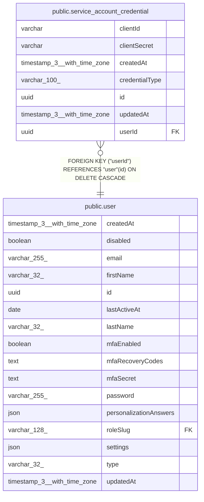

# public.service_account_credential

## Columns

| Name | Type | Default | Nullable | Children | Parents | Comment |
| ---- | ---- | ------- | -------- | -------- | ------- | ------- |
| clientId | varchar |  | false |  |  |  |
| clientSecret | varchar |  | false |  |  |  |
| createdAt | timestamp(3) with time zone | CURRENT_TIMESTAMP(3) | false |  |  |  |
| credentialType | varchar(100) |  | false |  |  |  |
| id | uuid |  | false |  |  |  |
| updatedAt | timestamp(3) with time zone | CURRENT_TIMESTAMP(3) | false |  |  |  |
| userId | uuid |  | false |  | [public.user](public.user.md) |  |

## Constraints

| Name | Type | Definition |
| ---- | ---- | ---------- |
| FK_cd5e25aee84dd359d3560d14335 | FOREIGN KEY | FOREIGN KEY ("userId") REFERENCES "user"(id) ON DELETE CASCADE |
| PK_e71c6b80f3e897d918981e2bcd9 | PRIMARY KEY | PRIMARY KEY (id) |
| service_account_credential_clientId_not_null | n | NOT NULL "clientId" |
| service_account_credential_clientSecret_not_null | n | NOT NULL "clientSecret" |
| service_account_credential_createdAt_not_null | n | NOT NULL "createdAt" |
| service_account_credential_credentialType_not_null | n | NOT NULL "credentialType" |
| service_account_credential_id_not_null | n | NOT NULL id |
| service_account_credential_updatedAt_not_null | n | NOT NULL "updatedAt" |
| service_account_credential_userId_not_null | n | NOT NULL "userId" |

## Indexes

| Name | Definition |
| ---- | ---------- |
| IDX_b370411ca86aed36c6ab4637c8 | CREATE UNIQUE INDEX "IDX_b370411ca86aed36c6ab4637c8" ON public.service_account_credential USING btree ("clientId") |
| IDX_d79432c443978eb5f470093d00 | CREATE INDEX "IDX_d79432c443978eb5f470093d00" ON public.service_account_credential USING btree ("userId", "credentialType") |
| PK_e71c6b80f3e897d918981e2bcd9 | CREATE UNIQUE INDEX "PK_e71c6b80f3e897d918981e2bcd9" ON public.service_account_credential USING btree (id) |

## Relations

---

> Generated by [tbls](https://github.com/k1LoW/tbls)
