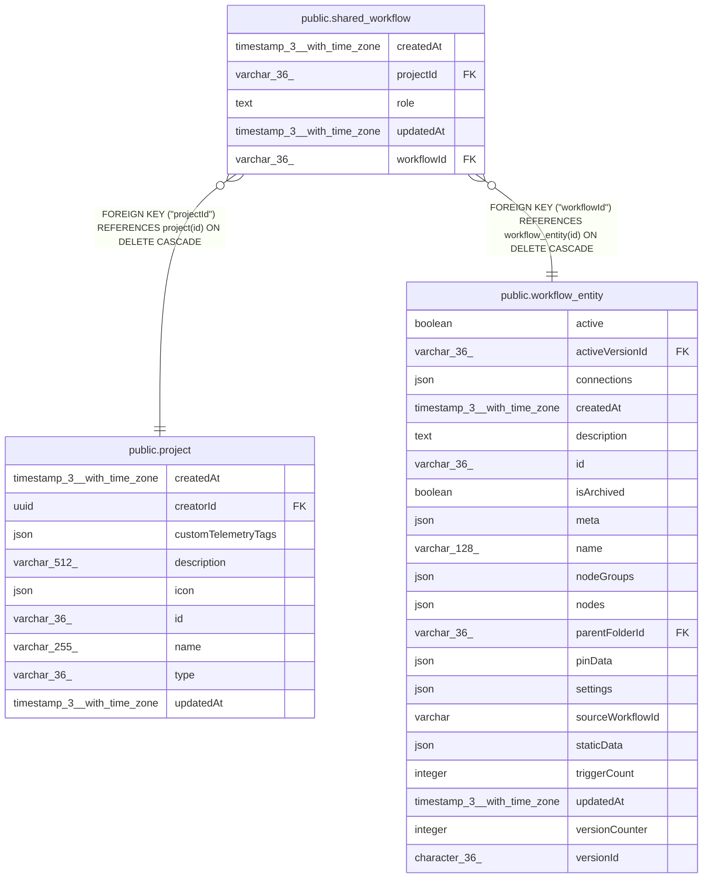

# public.shared_workflow

## Columns

| Name | Type | Default | Nullable | Children | Parents | Comment |
| ---- | ---- | ------- | -------- | -------- | ------- | ------- |
| createdAt | timestamp(3) with time zone | CURRENT_TIMESTAMP(3) | false |  |  |  |
| projectId | varchar(36) |  | false |  | [public.project](public.project.md) |  |
| role | text |  | false |  |  |  |
| updatedAt | timestamp(3) with time zone | CURRENT_TIMESTAMP(3) | false |  |  |  |
| workflowId | varchar(36) |  | false |  | [public.workflow_entity](public.workflow_entity.md) |  |

## Constraints

| Name | Type | Definition |
| ---- | ---- | ---------- |
| FK_a45ea5f27bcfdc21af9b4188560 | FOREIGN KEY | FOREIGN KEY ("projectId") REFERENCES project(id) ON DELETE CASCADE |
| FK_daa206a04983d47d0a9c34649ce | FOREIGN KEY | FOREIGN KEY ("workflowId") REFERENCES workflow_entity(id) ON DELETE CASCADE |
| PK_5ba87620386b847201c9531c58f | PRIMARY KEY | PRIMARY KEY ("workflowId", "projectId") |
| shared_workflow_2_createdAt_not_null | n | NOT NULL "createdAt" |
| shared_workflow_2_projectId_not_null | n | NOT NULL "projectId" |
| shared_workflow_2_role_not_null | n | NOT NULL role |
| shared_workflow_2_updatedAt_not_null | n | NOT NULL "updatedAt" |
| shared_workflow_2_workflowId_not_null | n | NOT NULL "workflowId" |

## Indexes

| Name | Definition |
| ---- | ---------- |
| IDX_shared_workflow_projectId | CREATE INDEX "IDX_shared_workflow_projectId" ON public.shared_workflow USING btree ("projectId") |
| PK_5ba87620386b847201c9531c58f | CREATE UNIQUE INDEX "PK_5ba87620386b847201c9531c58f" ON public.shared_workflow USING btree ("workflowId", "projectId") |

## Relations

---

> Generated by [tbls](https://github.com/k1LoW/tbls)
