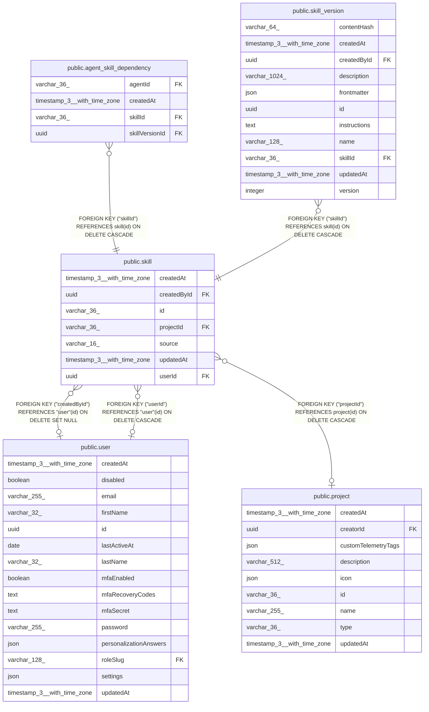

# public.skill

## Columns

| Name | Type | Default | Nullable | Children | Parents | Comment |
| ---- | ---- | ------- | -------- | -------- | ------- | ------- |
| createdAt | timestamp(3) with time zone | CURRENT_TIMESTAMP(3) | false |  |  |  |
| createdById | uuid |  | true |  | [public.user](public.user.md) | Author. NULL after the author is deleted |
| id | varchar(36) |  | false | [public.agent_skill_dependency](public.agent_skill_dependency.md) [public.skill_version](public.skill_version.md) |  | skill_\<nanoid\>, the same format agents use |
| projectId | varchar(36) |  | true |  | [public.project](public.project.md) | Set for a team project skill. NULL otherwise |
| source | varchar(16) |  | false |  |  | How the skill was created: "ui", "upload", or "agent" |
| updatedAt | timestamp(3) with time zone | CURRENT_TIMESTAMP(3) | false |  |  |  |
| userId | uuid |  | true |  | [public.user](public.user.md) | Set for a "Just you" skill. NULL otherwise |

## Constraints

| Name | Type | Definition |
| ---- | ---- | ---------- |
| CHK_skill_single_target | CHECK | CHECK ((("userId" IS NULL) OR ("projectId" IS NULL))) |
| CHK_skill_source | CHECK | CHECK (((source)::text = ANY ((ARRAY['ui'::character varying, 'upload'::character varying, 'agent'::character varying])::text[]))) |
| FK_402ed37bff0d3134f6e782455ed | FOREIGN KEY | FOREIGN KEY ("projectId") REFERENCES project(id) ON DELETE CASCADE |
| FK_4de4501583cd1fcd6f5ea85f547 | FOREIGN KEY | FOREIGN KEY ("createdById") REFERENCES "user"(id) ON DELETE SET NULL |
| FK_c08612011a88745a32784544b28 | FOREIGN KEY | FOREIGN KEY ("userId") REFERENCES "user"(id) ON DELETE CASCADE |
| PK_a0d33334424e64fb78dc3ce7196 | PRIMARY KEY | PRIMARY KEY (id) |
| skill_createdAt_not_null | n | NOT NULL "createdAt" |
| skill_id_not_null | n | NOT NULL id |
| skill_source_not_null | n | NOT NULL source |
| skill_updatedAt_not_null | n | NOT NULL "updatedAt" |

## Indexes

| Name | Definition |
| ---- | ---------- |
| IDX_402ed37bff0d3134f6e782455e | CREATE INDEX "IDX_402ed37bff0d3134f6e782455e" ON public.skill USING btree ("projectId") |
| IDX_c08612011a88745a32784544b2 | CREATE INDEX "IDX_c08612011a88745a32784544b2" ON public.skill USING btree ("userId") |
| PK_a0d33334424e64fb78dc3ce7196 | CREATE UNIQUE INDEX "PK_a0d33334424e64fb78dc3ce7196" ON public.skill USING btree (id) |

## Relations

---

> Generated by [tbls](https://github.com/k1LoW/tbls)
