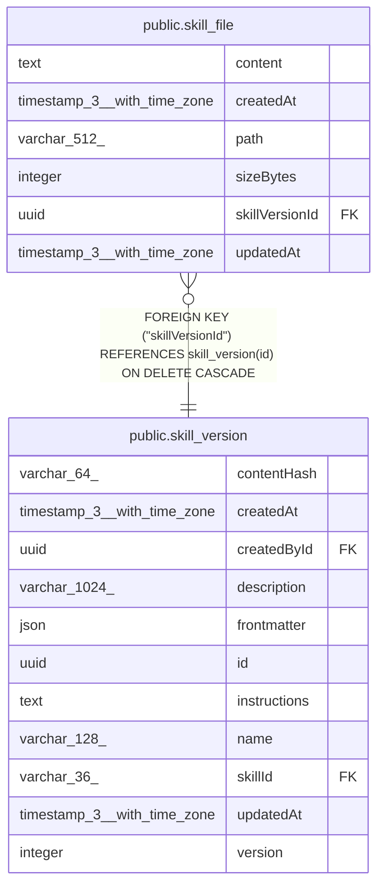

# public.skill_file

## Columns

| Name | Type | Default | Nullable | Children | Parents | Comment |
| ---- | ---- | ------- | -------- | -------- | ------- | ------- |
| content | text |  | false |  |  |  |
| createdAt | timestamp(3) with time zone | CURRENT_TIMESTAMP(3) | false |  |  |  |
| path | varchar(512) |  | false |  |  | Relative path, references/*.md in v1 |
| sizeBytes | integer |  | false |  |  | UTF-8 byte length of content |
| skillVersionId | uuid |  | false |  | [public.skill_version](public.skill_version.md) |  |
| updatedAt | timestamp(3) with time zone | CURRENT_TIMESTAMP(3) | false |  |  |  |

## Constraints

| Name | Type | Definition |
| ---- | ---- | ---------- |
| FK_e9ab50b795ec8858702b7333d13 | FOREIGN KEY | FOREIGN KEY ("skillVersionId") REFERENCES skill_version(id) ON DELETE CASCADE |
| PK_160721f9e4c22026c16138af2a1 | PRIMARY KEY | PRIMARY KEY ("skillVersionId", path) |
| skill_file_content_not_null | n | NOT NULL content |
| skill_file_createdAt_not_null | n | NOT NULL "createdAt" |
| skill_file_path_not_null | n | NOT NULL path |
| skill_file_sizeBytes_not_null | n | NOT NULL "sizeBytes" |
| skill_file_skillVersionId_not_null | n | NOT NULL "skillVersionId" |
| skill_file_updatedAt_not_null | n | NOT NULL "updatedAt" |

## Indexes

| Name | Definition |
| ---- | ---------- |
| PK_160721f9e4c22026c16138af2a1 | CREATE UNIQUE INDEX "PK_160721f9e4c22026c16138af2a1" ON public.skill_file USING btree ("skillVersionId", path) |

## Relations

---

> Generated by [tbls](https://github.com/k1LoW/tbls)
