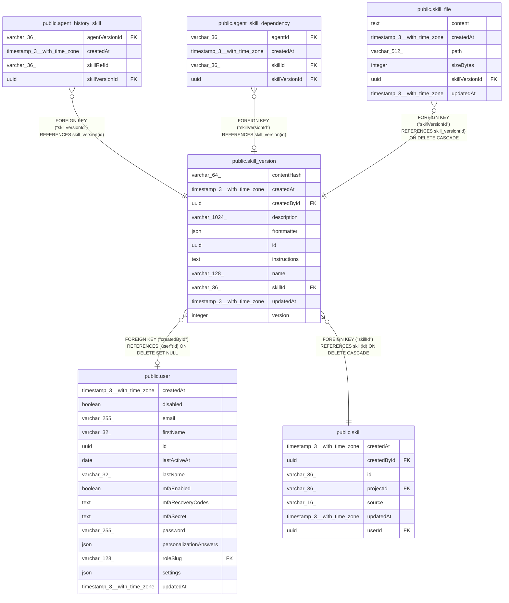

# public.skill_version

## Columns

| Name | Type | Default | Nullable | Children | Parents | Comment |
| ---- | ---- | ------- | -------- | -------- | ------- | ------- |
| contentHash | varchar(64) |  | false |  |  | sha256 of name, description, instructions, frontmatter and files. Save creates no version when the draft matches the latest one |
| createdAt | timestamp(3) with time zone | CURRENT_TIMESTAMP(3) | false |  |  |  |
| createdById | uuid |  | true |  | [public.user](public.user.md) | Author. NULL after the author is deleted |
| description | varchar(1024) |  | false |  |  |  |
| frontmatter | json |  | true |  |  | SKILL.md frontmatter fields other than name and description, e.g. allowed-tools |
| id | uuid |  | false | [public.agent_history_skill](public.agent_history_skill.md) [public.agent_skill_dependency](public.agent_skill_dependency.md) [public.skill_file](public.skill_file.md) |  |  |
| instructions | text |  | false |  |  |  |
| name | varchar(128) |  | false |  |  | Free-text skill name. The draft holds the current name, a saved version the name it was saved with |
| skillId | varchar(36) |  | false |  | [public.skill](public.skill.md) |  |
| updatedAt | timestamp(3) with time zone | CURRENT_TIMESTAMP(3) | false |  |  |  |
| version | integer |  | true |  |  | NULL for the editable draft. Save creates 1..n, which never change |

## Constraints

| Name | Type | Definition |
| ---- | ---- | ---------- |
| FK_9565d0fbf32cd463f9b47c7adab | FOREIGN KEY | FOREIGN KEY ("createdById") REFERENCES "user"(id) ON DELETE SET NULL |
| FK_f87064c0a29efd2d5195328d91a | FOREIGN KEY | FOREIGN KEY ("skillId") REFERENCES skill(id) ON DELETE CASCADE |
| PK_05167d59ac7599128e22400172d | PRIMARY KEY | PRIMARY KEY (id) |
| UQ_93bb78a1eb4e0890fac6b69df95 | UNIQUE | UNIQUE ("skillId", version) |
| skill_version_contentHash_not_null | n | NOT NULL "contentHash" |
| skill_version_createdAt_not_null | n | NOT NULL "createdAt" |
| skill_version_description_not_null | n | NOT NULL description |
| skill_version_id_not_null | n | NOT NULL id |
| skill_version_instructions_not_null | n | NOT NULL instructions |
| skill_version_name_not_null | n | NOT NULL name |
| skill_version_skillId_not_null | n | NOT NULL "skillId" |
| skill_version_updatedAt_not_null | n | NOT NULL "updatedAt" |

## Indexes

| Name | Definition |
| ---- | ---------- |
| IDX_03898a31727c7de3351839d67f | CREATE INDEX "IDX_03898a31727c7de3351839d67f" ON public.skill_version USING btree ("skillId", "contentHash") |
| IDX_skill_version_skillId | CREATE UNIQUE INDEX "IDX_skill_version_skillId" ON public.skill_version USING btree ("skillId") WHERE (version IS NULL) |
| PK_05167d59ac7599128e22400172d | CREATE UNIQUE INDEX "PK_05167d59ac7599128e22400172d" ON public.skill_version USING btree (id) |
| UQ_93bb78a1eb4e0890fac6b69df95 | CREATE UNIQUE INDEX "UQ_93bb78a1eb4e0890fac6b69df95" ON public.skill_version USING btree ("skillId", version) |

## Relations

---

> Generated by [tbls](https://github.com/k1LoW/tbls)
