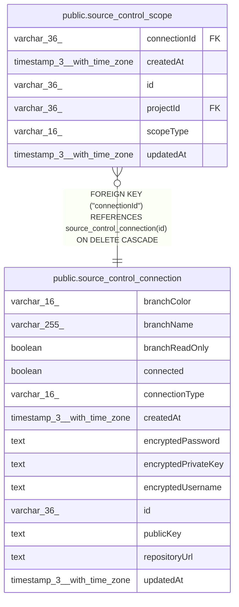

# public.source_control_connection

## Columns

| Name | Type | Default | Nullable | Children | Parents | Comment |
| ---- | ---- | ------- | -------- | -------- | ------- | ------- |
| branchColor | varchar(16) | '#5296D6'::character varying | false |  |  |  |
| branchName | varchar(255) | 'main'::character varying | false |  |  |  |
| branchReadOnly | boolean | false | false |  |  |  |
| connected | boolean | false | false |  |  |  |
| connectionType | varchar(16) |  | false |  |  |  |
| createdAt | timestamp(3) with time zone | CURRENT_TIMESTAMP(3) | false |  |  |  |
| encryptedPassword | text |  | true |  |  |  |
| encryptedPrivateKey | text |  | true |  |  |  |
| encryptedUsername | text |  | true |  |  |  |
| id | varchar(36) |  | false | [public.source_control_scope](public.source_control_scope.md) |  |  |
| publicKey | text |  | true |  |  |  |
| repositoryUrl | text |  | false |  |  |  |
| updatedAt | timestamp(3) with time zone | CURRENT_TIMESTAMP(3) | false |  |  |  |

## Constraints

| Name | Type | Definition |
| ---- | ---- | ---------- |
| CHK_source_control_connection_connectionType | CHECK | CHECK ((("connectionType")::text = ANY ((ARRAY['ssh'::character varying, 'https'::character varying])::text[]))) |
| PK_62b13b8ae2c3016f25728202252 | PRIMARY KEY | PRIMARY KEY (id) |
| source_control_connection_branchColor_not_null | n | NOT NULL "branchColor" |
| source_control_connection_branchName_not_null | n | NOT NULL "branchName" |
| source_control_connection_branchReadOnly_not_null | n | NOT NULL "branchReadOnly" |
| source_control_connection_connected_not_null | n | NOT NULL connected |
| source_control_connection_connectionType_not_null | n | NOT NULL "connectionType" |
| source_control_connection_createdAt_not_null | n | NOT NULL "createdAt" |
| source_control_connection_id_not_null | n | NOT NULL id |
| source_control_connection_repositoryUrl_not_null | n | NOT NULL "repositoryUrl" |
| source_control_connection_updatedAt_not_null | n | NOT NULL "updatedAt" |

## Indexes

| Name | Definition |
| ---- | ---------- |
| IDX_source_control_connection_repo_branch | CREATE UNIQUE INDEX "IDX_source_control_connection_repo_branch" ON public.source_control_connection USING btree ("repositoryUrl", "branchName") |
| PK_62b13b8ae2c3016f25728202252 | CREATE UNIQUE INDEX "PK_62b13b8ae2c3016f25728202252" ON public.source_control_connection USING btree (id) |

## Relations

---

> Generated by [tbls](https://github.com/k1LoW/tbls)
