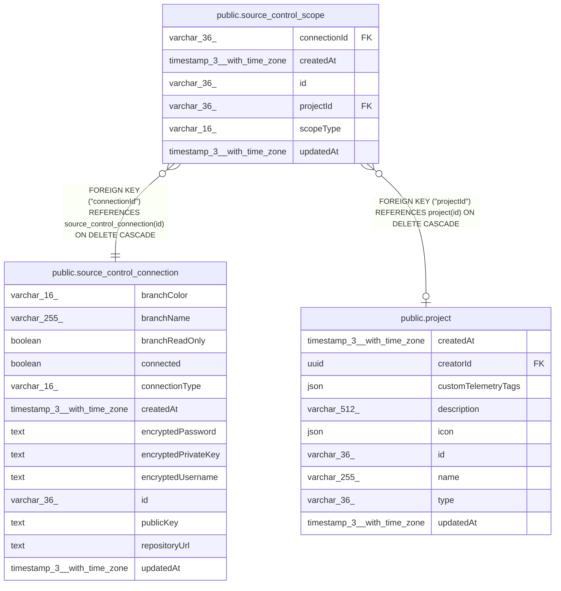

# public.source_control_scope

## Columns

| Name | Type | Default | Nullable | Children | Parents | Comment |
| ---- | ---- | ------- | -------- | -------- | ------- | ------- |
| connectionId | varchar(36) |  | false |  | [public.source_control_connection](public.source_control_connection.md) |  |
| createdAt | timestamp(3) with time zone | CURRENT_TIMESTAMP(3) | false |  |  |  |
| id | varchar(36) |  | false |  |  |  |
| projectId | varchar(36) |  | true |  | [public.project](public.project.md) |  |
| scopeType | varchar(16) |  | false |  |  |  |
| updatedAt | timestamp(3) with time zone | CURRENT_TIMESTAMP(3) | false |  |  |  |

## Constraints

| Name | Type | Definition |
| ---- | ---- | ---------- |
| CHK_source_control_scope_scopeType | CHECK | CHECK ((("scopeType")::text = ANY ((ARRAY['project'::character varying, 'instance'::character varying])::text[]))) |
| FK_72b7e38e545688d47bce4534384 | FOREIGN KEY | FOREIGN KEY ("connectionId") REFERENCES source_control_connection(id) ON DELETE CASCADE |
| FK_97d8e9baacd10e8ea11db44ed35 | FOREIGN KEY | FOREIGN KEY ("projectId") REFERENCES project(id) ON DELETE CASCADE |
| PK_5466e741188f23e3a7b29ed0c10 | PRIMARY KEY | PRIMARY KEY (id) |
| source_control_scope_connectionId_not_null | n | NOT NULL "connectionId" |
| source_control_scope_createdAt_not_null | n | NOT NULL "createdAt" |
| source_control_scope_id_not_null | n | NOT NULL id |
| source_control_scope_scopeType_not_null | n | NOT NULL "scopeType" |
| source_control_scope_updatedAt_not_null | n | NOT NULL "updatedAt" |

## Indexes

| Name | Definition |
| ---- | ---------- |
| IDX_source_control_scope_project | CREATE UNIQUE INDEX "IDX_source_control_scope_project" ON public.source_control_scope USING btree ("projectId") |
| PK_5466e741188f23e3a7b29ed0c10 | CREATE UNIQUE INDEX "PK_5466e741188f23e3a7b29ed0c10" ON public.source_control_scope USING btree (id) |

## Relations

---

> Generated by [tbls](https://github.com/k1LoW/tbls)
