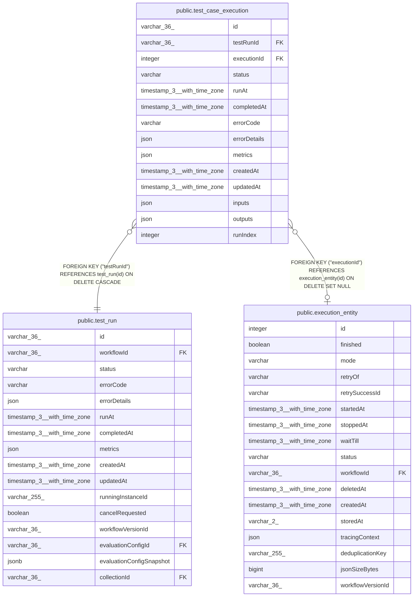

# public.test_case_execution

## Columns

| Name | Type | Default | Nullable | Children | Parents | Comment |
| ---- | ---- | ------- | -------- | -------- | ------- | ------- |
| id | varchar(36) |  | false |  |  |  |
| testRunId | varchar(36) |  | false |  | [public.test_run](public.test_run.md) |  |
| executionId | integer |  | true |  | [public.execution_entity](public.execution_entity.md) |  |
| status | varchar |  | false |  |  |  |
| runAt | timestamp(3) with time zone |  | true |  |  |  |
| completedAt | timestamp(3) with time zone |  | true |  |  |  |
| errorCode | varchar |  | true |  |  |  |
| errorDetails | json |  | true |  |  |  |
| metrics | json |  | true |  |  |  |
| createdAt | timestamp(3) with time zone | CURRENT_TIMESTAMP(3) | false |  |  |  |
| updatedAt | timestamp(3) with time zone | CURRENT_TIMESTAMP(3) | false |  |  |  |
| inputs | json |  | true |  |  |  |
| outputs | json |  | true |  |  |  |
| runIndex | integer |  | true |  |  |  |

## Constraints

| Name | Type | Definition |
| ---- | ---- | ---------- |
| test_case_execution_createdAt_not_null | n | NOT NULL "createdAt" |
| test_case_execution_id_not_null | n | NOT NULL id |
| test_case_execution_status_not_null | n | NOT NULL status |
| test_case_execution_testRunId_not_null | n | NOT NULL "testRunId" |
| test_case_execution_updatedAt_not_null | n | NOT NULL "updatedAt" |
| FK_e48965fac35d0f5b9e7f51d8c44 | FOREIGN KEY | FOREIGN KEY ("executionId") REFERENCES execution_entity(id) ON DELETE SET NULL |
| FK_8e4b4774db42f1e6dda3452b2af | FOREIGN KEY | FOREIGN KEY ("testRunId") REFERENCES test_run(id) ON DELETE CASCADE |
| PK_90c121f77a78a6580e94b794bce | PRIMARY KEY | PRIMARY KEY (id) |

## Indexes

| Name | Definition |
| ---- | ---------- |
| PK_90c121f77a78a6580e94b794bce | CREATE UNIQUE INDEX "PK_90c121f77a78a6580e94b794bce" ON public.test_case_execution USING btree (id) |
| IDX_8e4b4774db42f1e6dda3452b2a | CREATE INDEX "IDX_8e4b4774db42f1e6dda3452b2a" ON public.test_case_execution USING btree ("testRunId") |

## Relations

---

> Generated by [tbls](https://github.com/k1LoW/tbls)
