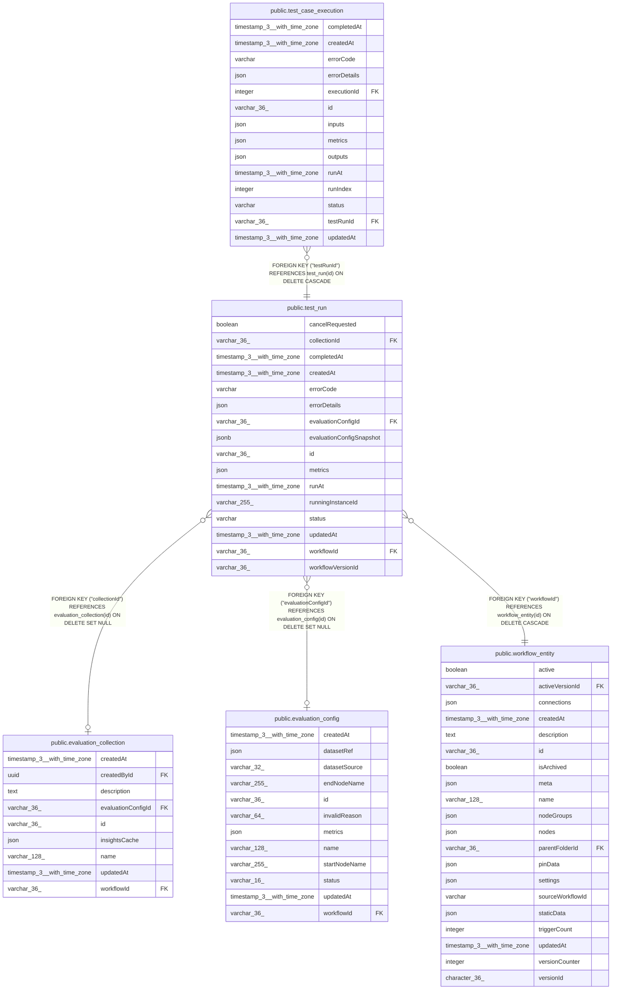

# public.test_run

## Columns

| Name | Type | Default | Nullable | Children | Parents | Comment |
| ---- | ---- | ------- | -------- | -------- | ------- | ------- |
| cancelRequested | boolean | false | false |  |  |  |
| collectionId | varchar(36) |  | true |  | [public.evaluation_collection](public.evaluation_collection.md) |  |
| completedAt | timestamp(3) with time zone |  | true |  |  |  |
| createdAt | timestamp(3) with time zone | CURRENT_TIMESTAMP(3) | false |  |  |  |
| errorCode | varchar |  | true |  |  |  |
| errorDetails | json |  | true |  |  |  |
| evaluationConfigId | varchar(36) |  | true |  | [public.evaluation_config](public.evaluation_config.md) |  |
| evaluationConfigSnapshot | jsonb |  | true |  |  |  |
| id | varchar(36) |  | false | [public.test_case_execution](public.test_case_execution.md) |  |  |
| metrics | json |  | true |  |  |  |
| runAt | timestamp(3) with time zone |  | true |  |  |  |
| runningInstanceId | varchar(255) |  | true |  |  |  |
| status | varchar |  | false |  |  |  |
| updatedAt | timestamp(3) with time zone | CURRENT_TIMESTAMP(3) | false |  |  |  |
| workflowId | varchar(36) |  | false |  | [public.workflow_entity](public.workflow_entity.md) |  |
| workflowVersionId | varchar(36) |  | true |  |  |  |

## Constraints

| Name | Type | Definition |
| ---- | ---- | ---------- |
| FK_d6870d3b6e4c185d33926f423c8 | FOREIGN KEY | FOREIGN KEY ("workflowId") REFERENCES workflow_entity(id) ON DELETE CASCADE |
| FK_test_run_collection_id | FOREIGN KEY | FOREIGN KEY ("collectionId") REFERENCES evaluation_collection(id) ON DELETE SET NULL |
| FK_test_run_evaluation_config_id | FOREIGN KEY | FOREIGN KEY ("evaluationConfigId") REFERENCES evaluation_config(id) ON DELETE SET NULL |
| PK_011c050f566e9db509a0fadb9b9 | PRIMARY KEY | PRIMARY KEY (id) |
| test_run_cancelRequested_not_null | n | NOT NULL "cancelRequested" |
| test_run_createdAt_not_null | n | NOT NULL "createdAt" |
| test_run_id_not_null | n | NOT NULL id |
| test_run_status_not_null | n | NOT NULL status |
| test_run_updatedAt_not_null | n | NOT NULL "updatedAt" |
| test_run_workflowId_not_null | n | NOT NULL "workflowId" |

## Indexes

| Name | Definition |
| ---- | ---------- |
| IDX_d6870d3b6e4c185d33926f423c | CREATE INDEX "IDX_d6870d3b6e4c185d33926f423c" ON public.test_run USING btree ("workflowId") |
| IDX_test_run_collectionId | CREATE INDEX "IDX_test_run_collectionId" ON public.test_run USING btree ("collectionId") |
| IDX_test_run_evaluationConfigId | CREATE INDEX "IDX_test_run_evaluationConfigId" ON public.test_run USING btree ("evaluationConfigId") |
| PK_011c050f566e9db509a0fadb9b9 | CREATE UNIQUE INDEX "PK_011c050f566e9db509a0fadb9b9" ON public.test_run USING btree (id) |

## Relations

---

> Generated by [tbls](https://github.com/k1LoW/tbls)
