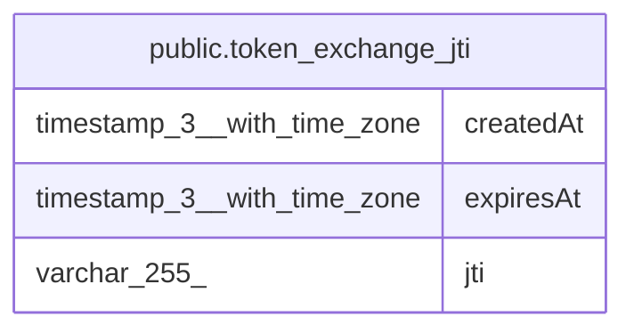

# public.token_exchange_jti

## Columns

| Name | Type | Default | Nullable | Children | Parents | Comment |
| ---- | ---- | ------- | -------- | -------- | ------- | ------- |
| createdAt | timestamp(3) with time zone |  | false |  |  |  |
| expiresAt | timestamp(3) with time zone |  | false |  |  |  |
| jti | varchar(255) |  | false |  |  |  |

## Constraints

| Name | Type | Definition |
| ---- | ---- | ---------- |
| PK_d8e8a6f737d530fdd2dd716e89c | PRIMARY KEY | PRIMARY KEY (jti) |
| token_exchange_jti_createdAt_not_null | n | NOT NULL "createdAt" |
| token_exchange_jti_expiresAt_not_null | n | NOT NULL "expiresAt" |
| token_exchange_jti_jti_not_null | n | NOT NULL jti |

## Indexes

| Name | Definition |
| ---- | ---------- |
| PK_d8e8a6f737d530fdd2dd716e89c | CREATE UNIQUE INDEX "PK_d8e8a6f737d530fdd2dd716e89c" ON public.token_exchange_jti USING btree (jti) |

## Relations

---

> Generated by [tbls](https://github.com/k1LoW/tbls)
