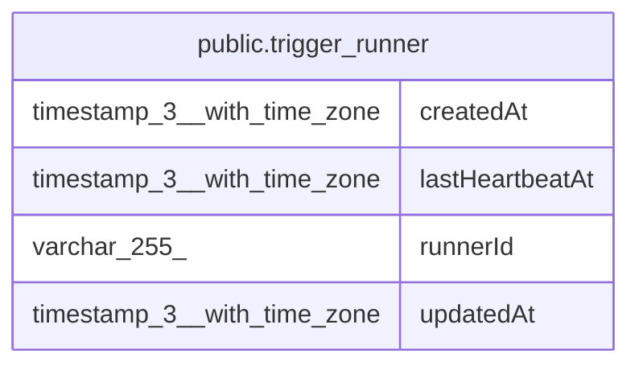

# public.trigger_runner

## Columns

| Name | Type | Default | Nullable | Children | Parents | Comment |
| ---- | ---- | ------- | -------- | -------- | ------- | ------- |
| createdAt | timestamp(3) with time zone | CURRENT_TIMESTAMP(3) | false |  |  |  |
| lastHeartbeatAt | timestamp(3) with time zone |  | false |  |  | Upserted every reconcile tick; older than TTL means the runner is gone. |
| runnerId | varchar(255) |  | false |  |  |  |
| updatedAt | timestamp(3) with time zone | CURRENT_TIMESTAMP(3) | false |  |  |  |

## Constraints

| Name | Type | Definition |
| ---- | ---- | ---------- |
| PK_f10c2f1c4aa12143266d0fa4db3 | PRIMARY KEY | PRIMARY KEY ("runnerId") |
| trigger_runner_createdAt_not_null | n | NOT NULL "createdAt" |
| trigger_runner_lastHeartbeatAt_not_null | n | NOT NULL "lastHeartbeatAt" |
| trigger_runner_runnerId_not_null | n | NOT NULL "runnerId" |
| trigger_runner_updatedAt_not_null | n | NOT NULL "updatedAt" |

## Indexes

| Name | Definition |
| ---- | ---------- |
| PK_f10c2f1c4aa12143266d0fa4db3 | CREATE UNIQUE INDEX "PK_f10c2f1c4aa12143266d0fa4db3" ON public.trigger_runner USING btree ("runnerId") |

## Relations

---

> Generated by [tbls](https://github.com/k1LoW/tbls)
