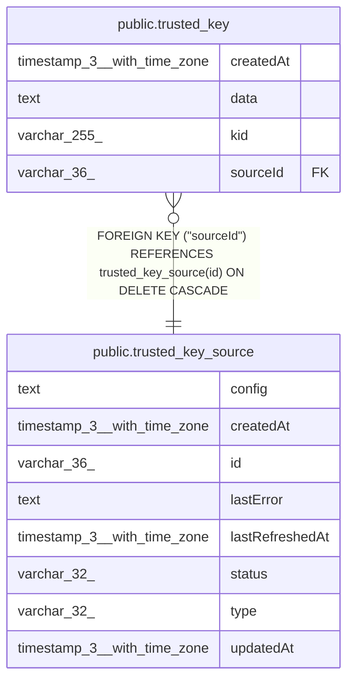

# public.trusted_key

## Columns

| Name | Type | Default | Nullable | Children | Parents | Comment |
| ---- | ---- | ------- | -------- | -------- | ------- | ------- |
| createdAt | timestamp(3) with time zone | CURRENT_TIMESTAMP(3) | false |  |  |  |
| data | text |  | false |  |  |  |
| kid | varchar(255) |  | false |  |  |  |
| sourceId | varchar(36) |  | false |  | [public.trusted_key_source](public.trusted_key_source.md) |  |

## Constraints

| Name | Type | Definition |
| ---- | ---- | ---------- |
| FK_8c2938d746943dd8f608d23c891 | FOREIGN KEY | FOREIGN KEY ("sourceId") REFERENCES trusted_key_source(id) ON DELETE CASCADE |
| PK_dc7d93798f3dbb6959f974c97e1 | PRIMARY KEY | PRIMARY KEY ("sourceId", kid) |
| trusted_key_createdAt_not_null | n | NOT NULL "createdAt" |
| trusted_key_data_not_null | n | NOT NULL data |
| trusted_key_kid_not_null | n | NOT NULL kid |
| trusted_key_sourceId_not_null | n | NOT NULL "sourceId" |

## Indexes

| Name | Definition |
| ---- | ---------- |
| PK_dc7d93798f3dbb6959f974c97e1 | CREATE UNIQUE INDEX "PK_dc7d93798f3dbb6959f974c97e1" ON public.trusted_key USING btree ("sourceId", kid) |

## Relations

---

> Generated by [tbls](https://github.com/k1LoW/tbls)
