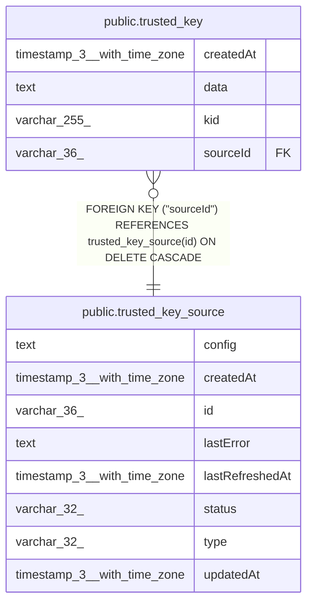

# public.trusted_key_source

## Columns

| Name | Type | Default | Nullable | Children | Parents | Comment |
| ---- | ---- | ------- | -------- | -------- | ------- | ------- |
| config | text |  | false |  |  |  |
| createdAt | timestamp(3) with time zone | CURRENT_TIMESTAMP(3) | false |  |  |  |
| id | varchar(36) |  | false | [public.trusted_key](public.trusted_key.md) |  |  |
| lastError | text |  | true |  |  |  |
| lastRefreshedAt | timestamp(3) with time zone |  | true |  |  |  |
| status | varchar(32) | 'pending'::character varying | false |  |  |  |
| type | varchar(32) |  | false |  |  |  |
| updatedAt | timestamp(3) with time zone | CURRENT_TIMESTAMP(3) | false |  |  |  |

## Constraints

| Name | Type | Definition |
| ---- | ---- | ---------- |
| PK_99e8908ce2c2cdccce487db7fc6 | PRIMARY KEY | PRIMARY KEY (id) |
| trusted_key_source_config_not_null | n | NOT NULL config |
| trusted_key_source_createdAt_not_null | n | NOT NULL "createdAt" |
| trusted_key_source_id_not_null | n | NOT NULL id |
| trusted_key_source_status_not_null | n | NOT NULL status |
| trusted_key_source_type_not_null | n | NOT NULL type |
| trusted_key_source_updatedAt_not_null | n | NOT NULL "updatedAt" |

## Indexes

| Name | Definition |
| ---- | ---------- |
| PK_99e8908ce2c2cdccce487db7fc6 | CREATE UNIQUE INDEX "PK_99e8908ce2c2cdccce487db7fc6" ON public.trusted_key_source USING btree (id) |

## Relations

---

> Generated by [tbls](https://github.com/k1LoW/tbls)
