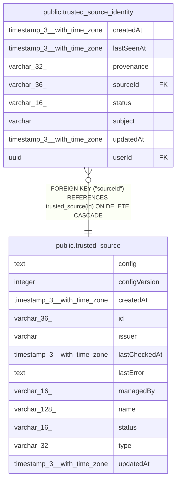

# public.trusted_source

## Columns

| Name | Type | Default | Nullable | Children | Parents | Comment |
| ---- | ---- | ------- | -------- | -------- | ------- | ------- |
| config | text |  | false |  |  |  |
| configVersion | integer |  | false |  |  |  |
| createdAt | timestamp(3) with time zone | CURRENT_TIMESTAMP(3) | false |  |  |  |
| id | varchar(36) |  | false | [public.trusted_source_identity](public.trusted_source_identity.md) |  |  |
| issuer | varchar |  | false |  |  |  |
| lastCheckedAt | timestamp(3) with time zone |  | true |  |  |  |
| lastError | text |  | true |  |  |  |
| managedBy | varchar(16) |  | false |  |  |  |
| name | varchar(128) |  | false |  |  |  |
| status | varchar(16) |  | false |  |  |  |
| type | varchar(32) |  | false |  |  |  |
| updatedAt | timestamp(3) with time zone | CURRENT_TIMESTAMP(3) | false |  |  |  |

## Constraints

| Name | Type | Definition |
| ---- | ---- | ---------- |
| PK_2eea0a99b54a2022620817b1ffb | PRIMARY KEY | PRIMARY KEY (id) |
| trusted_source_configVersion_not_null | n | NOT NULL "configVersion" |
| trusted_source_config_not_null | n | NOT NULL config |
| trusted_source_createdAt_not_null | n | NOT NULL "createdAt" |
| trusted_source_id_not_null | n | NOT NULL id |
| trusted_source_issuer_not_null | n | NOT NULL issuer |
| trusted_source_managedBy_not_null | n | NOT NULL "managedBy" |
| trusted_source_name_not_null | n | NOT NULL name |
| trusted_source_status_not_null | n | NOT NULL status |
| trusted_source_type_not_null | n | NOT NULL type |
| trusted_source_updatedAt_not_null | n | NOT NULL "updatedAt" |

## Indexes

| Name | Definition |
| ---- | ---------- |
| IDX_519e3445a1740f2ddbab2749b5 | CREATE UNIQUE INDEX "IDX_519e3445a1740f2ddbab2749b5" ON public.trusted_source USING btree (issuer) |
| IDX_d3055524099cd341a2af4b8eb9 | CREATE UNIQUE INDEX "IDX_d3055524099cd341a2af4b8eb9" ON public.trusted_source USING btree (name) |
| PK_2eea0a99b54a2022620817b1ffb | CREATE UNIQUE INDEX "PK_2eea0a99b54a2022620817b1ffb" ON public.trusted_source USING btree (id) |

## Relations

---

> Generated by [tbls](https://github.com/k1LoW/tbls)
