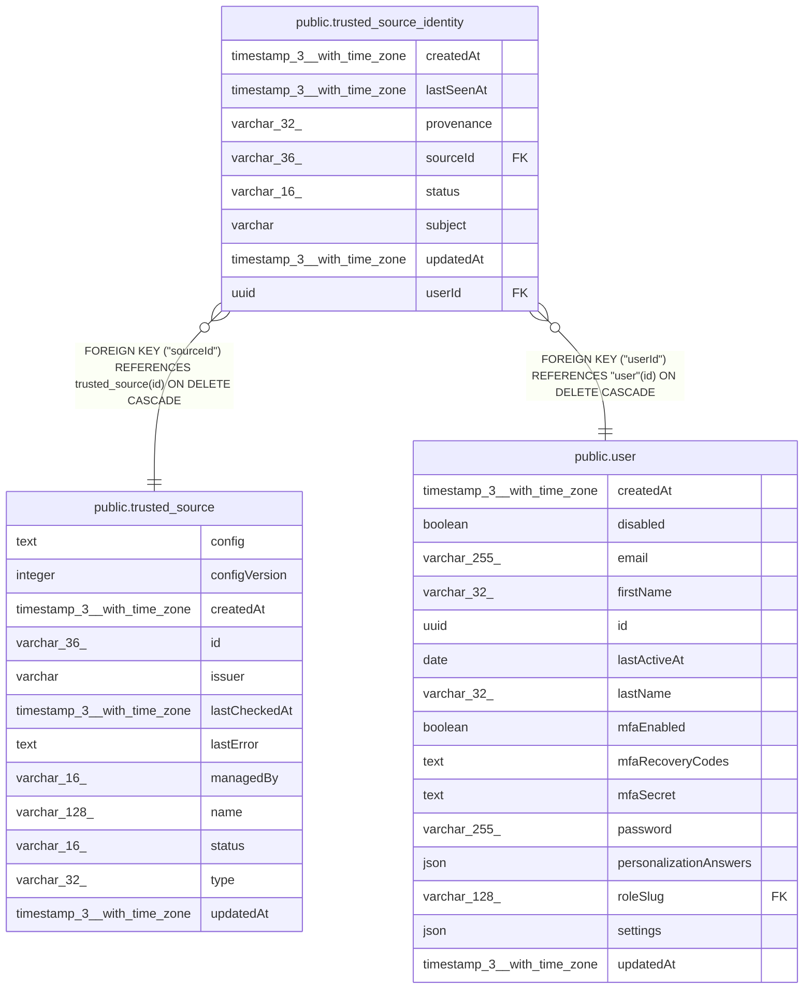

# public.trusted_source_identity

## Columns

| Name | Type | Default | Nullable | Children | Parents | Comment |
| ---- | ---- | ------- | -------- | -------- | ------- | ------- |
| createdAt | timestamp(3) with time zone | CURRENT_TIMESTAMP(3) | false |  |  |  |
| lastSeenAt | timestamp(3) with time zone |  | true |  |  |  |
| provenance | varchar(32) |  | false |  |  |  |
| sourceId | varchar(36) |  | false |  | [public.trusted_source](public.trusted_source.md) |  |
| status | varchar(16) |  | false |  |  |  |
| subject | varchar |  | false |  |  |  |
| updatedAt | timestamp(3) with time zone | CURRENT_TIMESTAMP(3) | false |  |  |  |
| userId | uuid |  | false |  | [public.user](public.user.md) |  |

## Constraints

| Name | Type | Definition |
| ---- | ---- | ---------- |
| PK_aaeab0a64d04b4c5620140f0221 | PRIMARY KEY | PRIMARY KEY ("sourceId", subject) |
| trusted_source_identity_createdAt_not_null | n | NOT NULL "createdAt" |
| trusted_source_identity_provenance_not_null | n | NOT NULL provenance |
| trusted_source_identity_sourceId_foreign | FOREIGN KEY | FOREIGN KEY ("sourceId") REFERENCES trusted_source(id) ON DELETE CASCADE |
| trusted_source_identity_sourceId_not_null | n | NOT NULL "sourceId" |
| trusted_source_identity_status_not_null | n | NOT NULL status |
| trusted_source_identity_subject_not_null | n | NOT NULL subject |
| trusted_source_identity_updatedAt_not_null | n | NOT NULL "updatedAt" |
| trusted_source_identity_userId_foreign | FOREIGN KEY | FOREIGN KEY ("userId") REFERENCES "user"(id) ON DELETE CASCADE |
| trusted_source_identity_userId_not_null | n | NOT NULL "userId" |

## Indexes

| Name | Definition |
| ---- | ---------- |
| IDX_bcc1e89f2ab58755614b601168 | CREATE INDEX "IDX_bcc1e89f2ab58755614b601168" ON public.trusted_source_identity USING btree ("userId") |
| PK_aaeab0a64d04b4c5620140f0221 | CREATE UNIQUE INDEX "PK_aaeab0a64d04b4c5620140f0221" ON public.trusted_source_identity USING btree ("sourceId", subject) |

## Relations

---

> Generated by [tbls](https://github.com/k1LoW/tbls)
