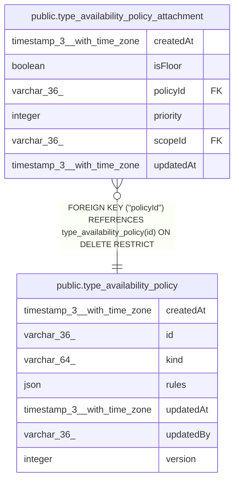

# public.type_availability_policy

## Columns

| Name | Type | Default | Nullable | Children | Parents | Comment |
| ---- | ---- | ------- | -------- | -------- | ------- | ------- |
| createdAt | timestamp(3) with time zone | CURRENT_TIMESTAMP(3) | false |  |  |  |
| id | varchar(36) |  | false | [public.type_availability_policy_attachment](public.type_availability_policy_attachment.md) |  |  |
| kind | varchar(64) |  | false |  |  |  |
| rules | json |  | false |  |  |  |
| updatedAt | timestamp(3) with time zone | CURRENT_TIMESTAMP(3) | false |  |  |  |
| updatedBy | varchar(36) |  | false |  |  |  |
| version | integer | 1 | false |  |  |  |

## Constraints

| Name | Type | Definition |
| ---- | ---- | ---------- |
| PK_7dc9809c6d53a6b8b8a62cd7798 | PRIMARY KEY | PRIMARY KEY (id) |
| type_availability_policy_createdAt_not_null | n | NOT NULL "createdAt" |
| type_availability_policy_id_not_null | n | NOT NULL id |
| type_availability_policy_kind_not_null | n | NOT NULL kind |
| type_availability_policy_rules_not_null | n | NOT NULL rules |
| type_availability_policy_updatedAt_not_null | n | NOT NULL "updatedAt" |
| type_availability_policy_updatedBy_not_null | n | NOT NULL "updatedBy" |
| type_availability_policy_version_not_null | n | NOT NULL version |

## Indexes

| Name | Definition |
| ---- | ---------- |
| PK_7dc9809c6d53a6b8b8a62cd7798 | CREATE UNIQUE INDEX "PK_7dc9809c6d53a6b8b8a62cd7798" ON public.type_availability_policy USING btree (id) |

## Relations

---

> Generated by [tbls](https://github.com/k1LoW/tbls)
